# machine learning with Li Hongyi

[TOC]

## Optimization for DL

### What you have known before?

- SGD
- SGD with momentum
- Adagrad
- RMSProp
- Adam

### Notations

### On-line vs Off-line

on-line: 一个time step只能获得一个训练样本计算出y，然后求得Loss

off-line:一个time step可以把所有训练样本放入模型，得出y计算Loss，这是理想情况，之后所有讨论都是基于这个假设

### SGD, stochastic gradient descent

每个time step往梯度的反方向走

### SGDM, SGD with Momentum

每个time step的movement都要加一个momentum向量，来避免梯度消失

momentum即上一步的movement，当某一点梯度接近零时，由于有momentum加入，移动得不会特别慢

### Adagrad

learning rate要除以之前所有梯度的平方和的开方，这样假如之前梯度特别大，下降的步子就会小一些（陡峭的地方不要冲得太猛），假如之前梯度特别小，下降的步子就会大一些（平缓的地方走的快些）

### RMSProp

避免Adagrad中learning rate要除的那个数无止境增大，引入alpha，对上一步的梯度和之前梯度的平方和做一个平均。

### Adam

以上方法还是没法解决在梯度为零处停止的问题。

Adam其实是SGDM加上RMSProp得到的方法：

- mt代替梯度：mt由上一步的momentum和梯度加权平均，而真正用到的mt_hat，是把mt除以小于1的一个参数，来保证它在t小时足够大
- vt用来修正learning rate，vt同样除以小于1的一个数来保证在t小时足够大，vt_hat加上一个epsilon来保证一开始t=0的时候不会因为vt_hat=0，而使learning rate爆掉。

### 为什么14年之后没有更好的optimizer被提出来？

近年最优秀的模型几乎都是用Adam和SGDM训练出来的，Adam在训练集上表现最好，但是在validation set上SGDM表现最好，而且SGDM收敛得更好。

有人提出开始用Adam，后期用SGDM，但上中间切换算法时的规则很难制定。

### 改进Adam

假设前1000步的梯度都是1，突然有一步梯度达到了10000，这一步的learning rate由于前面的影响也只能达到10倍根号10的learning rate，这是adam的问题，在最后阶段，大部分梯度都极小，偶尔一些包含重要信息的大梯度也没法产生作用。

假如t-1的v_hat比t步算得的v大的话，t步的v_hat直接取上一步的v_hat，这样，假如有一步梯度特别大，那么后面的learning rate会很小，就凸显了大梯度的作用。但是这样做的话，learning rate会一直减小。只解决了小梯度得到大learning rate的问题是AMSGrad的问题

AdaBound给learning rate做了一个clip，给它设计了一个上界upper bound和一个下界lower bound。这样做失去了learning rate的自适应性，所以也不是最好的方法。

### 改进SGDM

SGD类的算法不是自适应的，设置小learning rate就走得太慢，设置大learning rate就走得太快。怎么样找到最佳learning rate呢？

让learning rate在上下界之间反复循环，learning rate变大时，就是鼓励算法去探索，以更快地收敛。

learning rate只做一个cycle，lr最开始一直上升（warm-up），直到到达比较好的local minima，就开始下降（annealing），最后进入微调直至收敛（fine- tuning）。

### Adam需要warm-up吗？Of Course!

纵轴是iteration，可以看出没有warm-up时，前十次迭代的曲线与后面不同，横轴是梯度值范围，高度是此梯度值出现的频率，没有warm-up的话，在前10步（iteration: 1~10），梯度值是不稳的，有warm-up时，梯度值集中在一个区间上。

不稳定的梯度会导致不稳定的EMA，进而导致不准确的learning rate，learning rate假如暴走，会导致更严重的后果（如右上图所示），所以，我们至少可以在训练开始时控制learning rate小一些。

RAdam方法，前4步用固定的learning rate(SADM)，4步后在Adam的基础上乘以一个rt，这个rt完全依赖于ρ

下面提出另一类方法：

theta是fast weight，即用之前提出的任意方法走k步，然后减去最开始的点，用这段距离的alpha倍加上最开始的点，即为真正要走的1步。

fast weight的走法会降低不管是训练还是测试准确性，而interpolation恢复了原始表现。

### Nesterov accelerated gradient (NAG)

momentum方法是有问题的，当函数下降到低谷时，梯度为零，但是动量仍有，所以不会停下，就会继续走，走到前面发现会上升，这时又会往回走，所以能不能预测到前面的路呢，于是就有了NAG法

NAG在SGDM基础上，计算动量时把theta(t-1)的梯度改成了theta(t-1)的梯度减去t-1的动量，等于是用m(t-1)模拟m(t)，theta(t-1)-m(t)，这不就是下一步的位置吗，这个求梯度不就是下一步的梯度吗，这不就是预测了移动后的梯度吗，以这个梯度为参考，就能避免因动量产生的多余动作。

但是，这样就要维护两份model parameters，因为theta(t-1)其实就是参数向量，theta(t-1)-m(t-1)预测出来下一步的参数，然后计算梯度，同时因为还要用原始的theta(t-1)-m(t)来计算真正的下一步参数，所以系统要维护两份参数（theta(t-1)-m(t-1)和theta(t-1)），会占据大量空间。

经过一系列的数学推倒，可以简化公式，使得NAG具体运用时不用维护多个momentum，节省空间。新公式就是SGDM上面的那两行，用thata'来代替theta

对比新公式和SGDM的公式，发现就是把第一行的m(t-1)换成m(t)，SGDM就变成了NAG

那么，把Adam中的m(t-1)也超前部署一下，就能获得超前的特性了：

### Nadam

对比Adam的改进方法NAdam和SGDM的第一项，同样是梯度所在项不变，只改momentum所在项，就得到了Nadam

### 关于正则化项

在实际使用是，我们往往要在Loss后面加上一个L2正则化项（注意，图里写错了，gamma前面应有个1/2），为的是让theta不要太大，theta太大，会容易陷入崎岖的深谷

但是，在SGDM和Adam的情况中，mt和vt是否要加上正则化项呢？

17年的一篇paper提出不要加，这两种算法是现今常用的算法，之前讲的都不常见（除非是专门研究优化算法的人）

### 几个优化时用到的小tips

1. Shuffling：data输入时不要按顺序输入，要随机输入

2. Drapout：神经元的输出如果没有意义就mute掉

3. Gradient noise：计算梯度时加上一个噪声

   

这几个tip其实都是为了鼓励优化算法去探索：The more exploration，the better！

1. Warm-up：一开始learning rate比较小，等稳定之后再调大

2. Curriculum learning：先用简单的没有噪声的数据去训练，找到大概的位置（平缓的local minma），再用难的数据，这样可以避免掉进深谷。

   

3. Fine-tuning：用网上找到的已经train好的model，在这些model的基础上用自己的方法去train，可以省事。

### All in All

没有万能的optimizer，而且假如你的模型训练的不好，也往往不是optimizer的原因，往往是你的数据不好，架构不好或者训练技巧不好。

## Classification

### How to do Classification

可以用回归的方法来解决分类问题吗？把一类看做1，另一类看做-1，回归的结果接近1就看做第一类，接近-1就看做第二类。这样其实是有问题的：

假如训练数据中有远大于1的数据，那么最终回归的结果会是紫色那条线，但是对于分类问题，绿色那条线才是正确的，即，“过于正确”的数据也会影响结果。

而且，在多分类问题中，比如三种类型，就用1，2，3三个数字来代表，这等于无意中在这三种类型间建立了关系，但是类型间其实是没有这样的关系的。

理想的训练方案是：模型f(x)包含g(x)>0则分为第一类，否则第二类。Loss function是分类错误的次数，寻优方法有Perceptron，SVM等（无法用之前讲的回归中用的梯度下降等方法（损失函数无法微分））

从盒子中抽出一个蓝球，是来自Box1的几率=B1抽出蓝球的几率乘从B1中抽球的几率/从B1中抽球且是蓝球的几率+从B2中抽球且是蓝球的几率

二分类问题与刚才的抽球问题一样，假设有两个class，x是某一个数据，比如说x是蓝的（即数据的属性），二分类问题就是判断这样一个蓝球究竟是c1还是c2，同样是计算概率，假如P(C1|x)>P(C2|x)就判断x属于class 1，反之class 2。

为了得出需要的概率，我们必须设法计算出红框中的四个概率，通过这四个概率，我们可以得到一个Generative Model（即用全概率公式计算x出现的几率），这样我们就可以自己产生x

宝可梦水系和一般系，计算从水系抽的概率和从一般系抽的概率，很简单，所有宝可梦中，水系有79只，一般系有61只

每一只宝可梦都可以用属性向量来表示

假设只有两种属性，那么水属性宝可梦的分布如图，假如杰尼龟和可达鸭是training data里面的，我们可以知道他们的概率，可是假如有个海龟，我们知道它是水属性，但它不在79只宝可梦里，怎么估计它的概率呢？

我们假设这些样本服从高斯分布

高斯分布：输入是向量x，输出是x的概率密度（这里为了好理解写成概率，其实两者是成正比的），公式由均值μ和协方差矩阵sigma决定，mu决定圆心位置，sigma决定圆的大小

假如从样本的分布中看出mu和sigma，就能得到样本的高斯分布（离中心点越近概率越大），通过高斯分布的式子就可以计算出新点的概率，那么怎么计算mu和sigma呢？

使用极大似然估计：不同的mu和sigma得出的高斯分布是不同的，而高斯分布的likelihood=每个样本出现的概率的乘积

79只已知宝可梦决定的高斯分布的极大似然估计就是：找到让likelihood最大的mu和sigma。

现在可以做分类了，x是C1类的概率大于0.5就属于C1.

右上图是得出的预测模型，测试后准确率只有47percent，把特征扩展到七维，准确率也只有545percent。

这里高斯应该是模型，然后极大似然应该算是一种优化方法？

改进模型，两个模型用不同的sigma是不合适的，sigma和输入数据的特征数的平方成正比，即输入向量的维数越高，sigma增长的会非常快，会容易overfitting（越复杂的模型越容易overfitting），所以用一样的sigma就可以用更少的参数（即feature数）了

共用sigma后，sigma用加权平均的方式来求，mu还是跟以前一样分别求平均，极大似然估计变成了估计mu1，mu2，sigma

结果有了73percent的准确率（而且分界线变成了直线）

### All in All

- 为什么用高斯分布？没有为什么，你可以用任何你认为正确的分布，只不过参数的数量不同
- 一种假设：我们假设x的所有feature是独立分布的，那么原来的x的概率就可以分解成每一个feature的概率的的乘积，这样每一的feature的高斯分布就是一个一维高斯分布，sigma就是一个对角矩阵，模型就更加简单，这样产生的分类器被成为朴素贝叶斯分类器（我们之前把feature组成向量去求mu和sigma的方法是把feature之间想象成有关系去做的）
- 对二分类feature，就是feature的值不是数值，而是是或否，比如宝可梦是否神兽之类的，就不太可能服从高斯分布，这时可以用伯努利分布

### 后验概率Posterior Probability

把我们的模型上下同除P(C1)，令z=C1的两概率/C2的两概率的natural log，我们发现模型中分母中那项等于exp(-z)，我们的模型是sigmoid function

下面是一系列数学推导

最终可以看出sigma1=sigma2时，P(C1|x)是一个线性模型，我们甚至可以不用去求N，mu，sigma那么多东西，而是直接去求w和b。

## Logistic Regression

### Step 1: Function Set

我们要求的是x是C1的概率，我们假设x服从高斯分布的话，这个概率就等于sigmoid(z)，其中z包含两个参数w=(w1,w2,...,wn)和b，下面是图示(里面公式写错了，少了+b）

f=sigmoid(wx+b)，这就是逻辑回归Logistic Regression，它的输出是0到1之间的一个概率。

### Step 2：Goodness of a Function

我们由一组training data：x1~N，像极大似然估计一样，我们对function寻优是找一组能够使每个x的几率乘积最大的参数w和b（要使f最符合training data的y-hat，就是让属于C1的x的几率最大，属于C2的x用1减去它属于C1的几率，最大）

使likelihood最大为了简化计算给它加上一个ln，就可以拆成加法，再前面加一个负号，变成了取最小，这个求和的每一项就是一个**交叉熵Cross entropy**。

是两个伯努利分布的交叉熵，交叉熵算的是两个分布的接近程度，越接近就越趋向于0。这里In this case，p是现实中的x的分布，属于c1的几率是yhat，不属于是1-yhat，而我们用f预测的分布是，x属于c1是f，不属于是1-f，现在用交叉熵去判断现实与预测是否接近。

### Step 3: Find the best funciton

有了Loss函数——即真实分布和预测分布的交叉熵，下一步就是最优化，用Gradient Descent就可以了，对每个wi求偏导，就能求出梯度，上图是推导过程，最后的结果十分neat。（这里上标n是第n个data的意思）

### What if use square error as your Loss function？

假如用Linear Regression的square error来做Loss function，进行gradient descent就会出现问题，

假如yhat=1，即第n个data是C1类，如果计算的f=1，也就是说拟合的完美，梯度等于0，这没错，但是当f=0时，拟合的完全不对，按式子算出来的梯度也是0，可以验证yhat=0的时候，也是这样。

squre error即使在里最优解非常远的地方梯度值也很小，远远不如cross entropy合适。

## Brief Introduction of Deep Learning

### Ups and Downs of Deep Learning

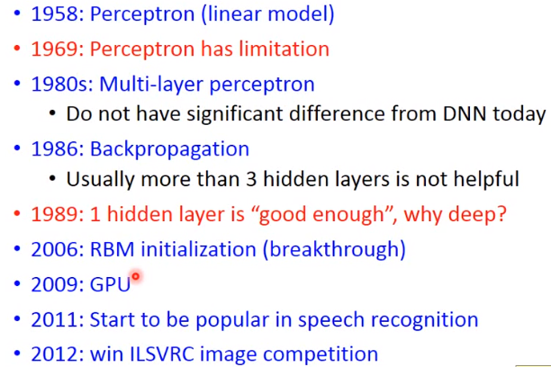

### Three Steps for DL

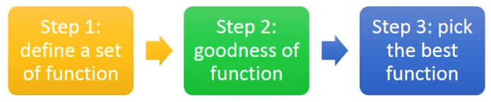

和ML一样，DL也只有3步，DL的function set是一个Neural Network

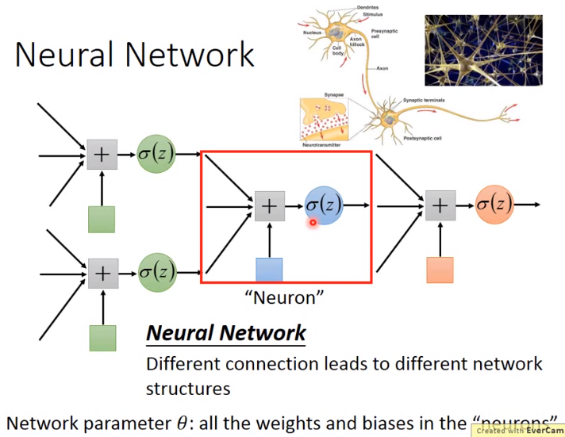

每一个neuron是其实是一个Logistic Regression，每个Logistic Regression都有自己的weight和bias，这些weight和bias联系起了neuron

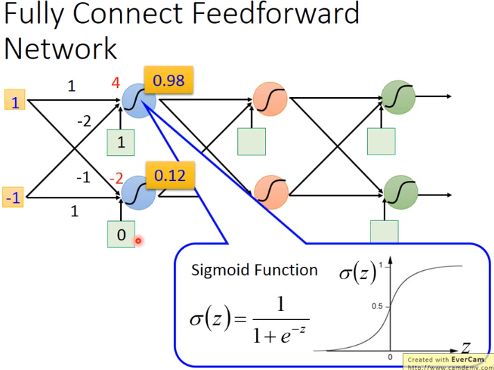

以上面的蓝色神经元为例，输入是（1，-1），weight是1和-2，bia是1，输出sigmoid(1*1+(-1)\*(-2)+1)=sigmoid(4)=0.98

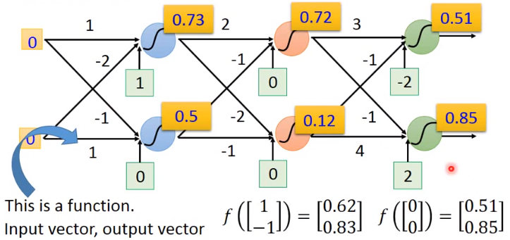

改变参数w和b，就能得到一个function set。

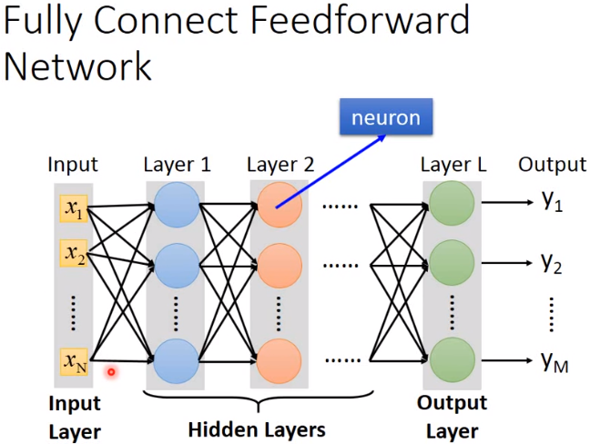

两个layer之间的神经元全都互相连接，所以是fully connect，因为是从input向前传，所以是feedforward，input虽然没有神经元，我们也把它叫做一个layer。

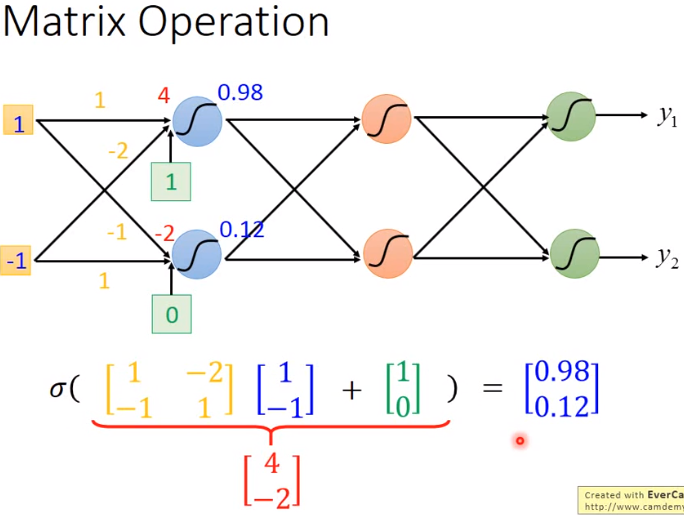

这是layer之间运算的矩阵表示，激活函数也不一定是sigmoid函数，现在很少有人用sigmoid函数了。

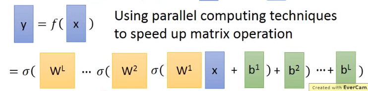

矩阵运算的好处就是，可以用gpu来加速

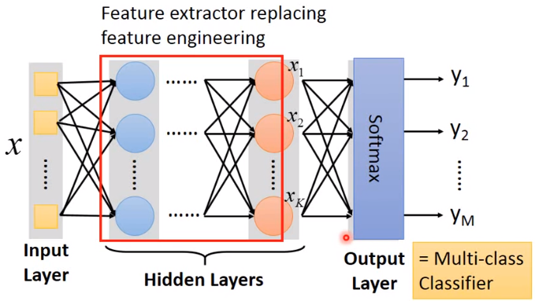

当做多分类问题来看，中间的hidden layers可以看做在提取x的特征（x本身就是特征，这里只是提取出更好分类的特征），output layer可以看做是一个multi-class classifier，通常会做一个softmax再输出。

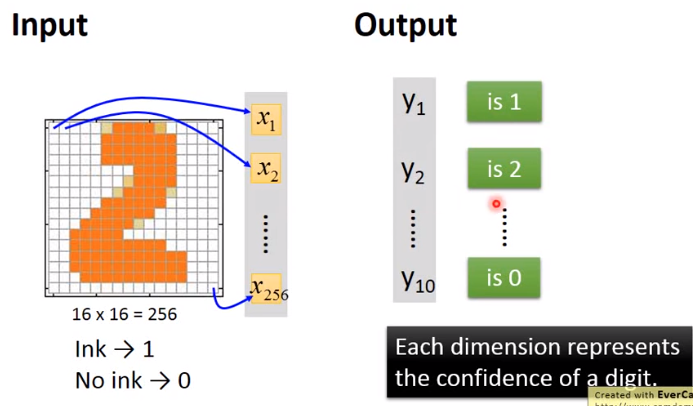

举一个文字识别的例子，输入是256维vector，输出是y，y其实是probability distribution，元素依次对应这个数字是1，是2……的概率，哪个概率最大，就是哪个数字

all in all，要做一个handwriting digit recognition，输入是256维vector，输出一定是10维vector，所以input、output layer都已经确定了，我们需要设计的就是中间hidden layers的结构。

对于ML，我们面对的问题往往是extract一组合适的feature，对于DL，我们不再需要精挑细选feature，而是去设计network。

### Definition of Loss Function

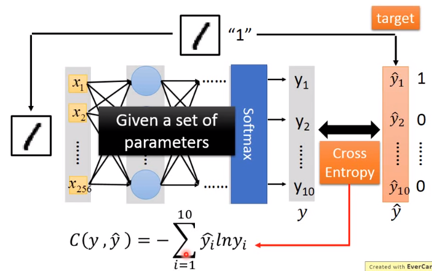

对于这个例子来说，Loss就是计算y和yhat之间的cross entropy。

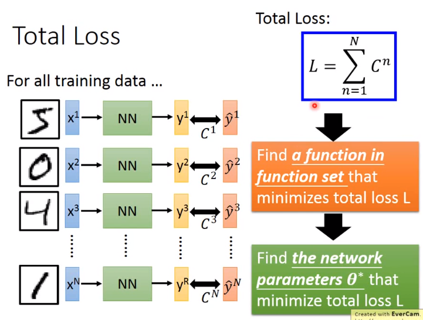

对所有training data计算cross entropy，求和得到total Loss，我们的目前就是选一组parameters minimize这个total loss

minimize的方法，就是**Gradient Descent**，但是neural network的function相当复杂，要手算微分，得到gradient太难了，一种简单的计算偏导的方法就是**Backpropagation**

## Backpropagation

To compute the gradients efficiently, we use **backpropagation**.

### Chain Rule

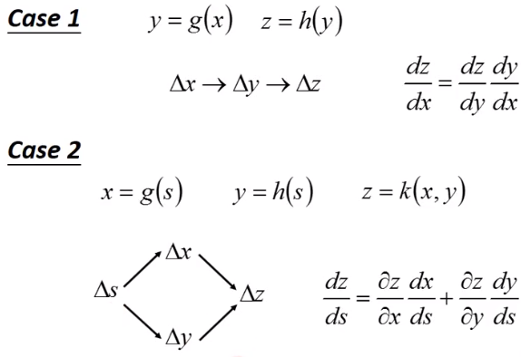

### Problem

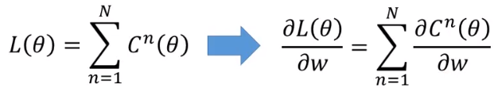

gradient descent needs to compute网络中每个参数w对交叉熵C的偏微分

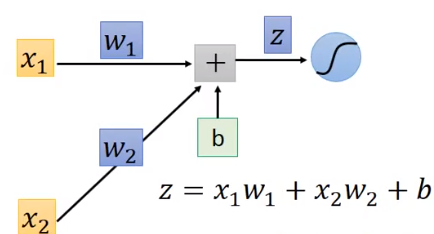

拿一个neuron来看，C是sigmoid函数一步步来的，sigmoid函数的自变量是z，所以C是z的函数，z又是w的函数，所以

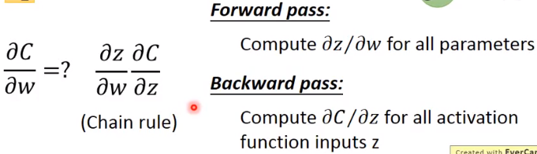

forward pass很好求

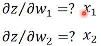

假设每个神经元的输出为a=sigmoid(z)，那么C是a的函数，a是z的函数，而a又是下一层z'的自变量，这一层神经元的z对C的偏微分可以由a对z的偏微分和C对z'、z'对a的偏微分算出：

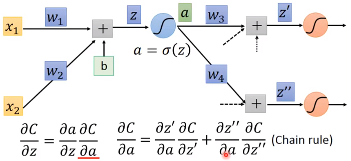

所以只需要从最后一层的y往回倒推就能算出所有z对C的偏微分（C是y的函数，C其实是y和yhat算出来的，跟y是最近的）

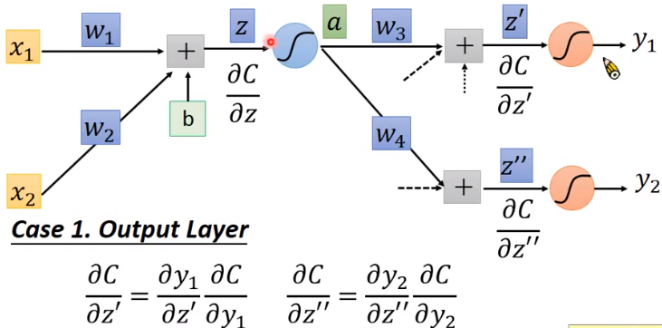

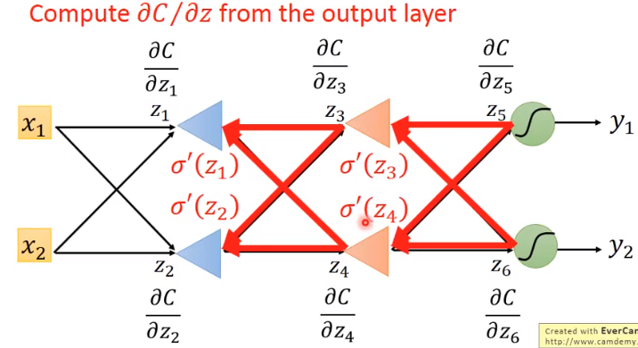

所以我们要的w对C的微分就是Forward Pass和Backward Pass的乘积。

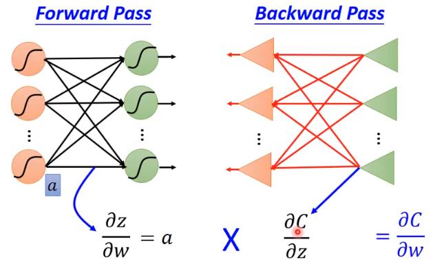

## Tips for Deep Learning

after 3 steps, the first thing you need to do is to test whether your network could get good results on **TRAINING DATA**, instead of testing data, because DL is not that easy to fit training data as well as ML. Then, you could test the performance of your network on testing data.

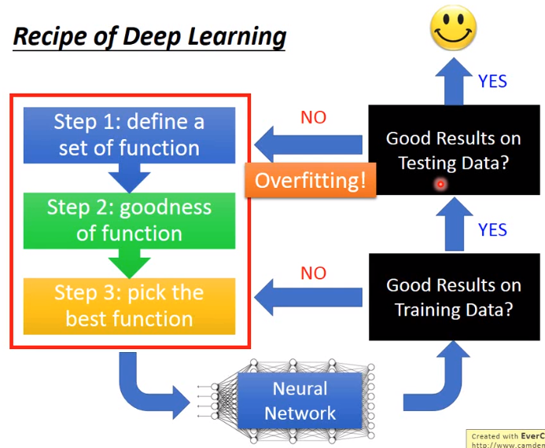

**Do not always blame overfitting**, only in the case that results on training data is better than on testing data, you can blame overfitting.

**Different approaches for different problems.** e.g. **dropout** is proper to be used when your results on testing data is bad and at the same time your results on training data is good, namely, **overfitting**.

### Tricks of modify your Neural Network

#### For Good Results on Training Data but Bad Results on Testing Data

- Early Stopping
- Regularization
- Dropout

#### For Bad Results on Training Data

- New activation function
- Adaptive Learning Rate

### Example of New activation function

**In 'sigmoid' era, Deeper usually does not imply better**, why?

the reason is **not overfitting**. it's vanishing gradient problem.

### Vanishing Gradient Problem

for neurons in layers near the input, their w's gradients are always smaller than those near the output, their parameters change slower, as a result, when the parameters of layers near the output converge, the near input ones are almost random.

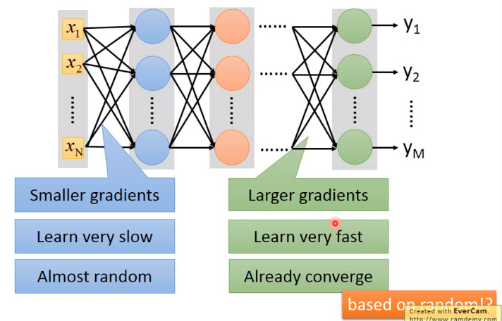 

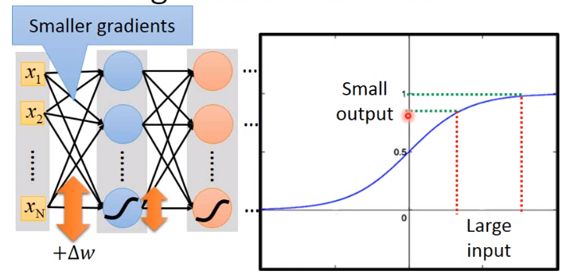

the fatal feature of sigmoid function is it converge the large input into (0,1). it turn out that the change of w near the input affects output slightly.

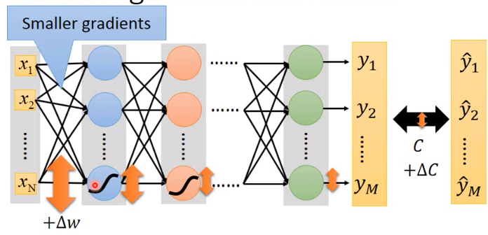

not until your parameters near the input converge, your gradient should be 0 and your loss drop into local minima.

earlier solution is layer-wise pre-training(逐层训练)

now, we always use **Rectified Linear Unit** as activation function

### ReLU

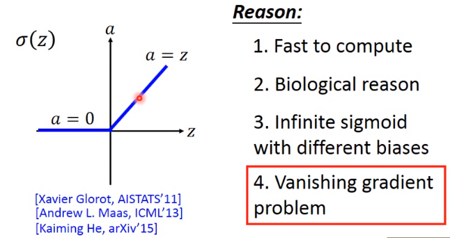

there are four reasons why we use ReLU. the most important factor is it can handle vanishing gradient problem.

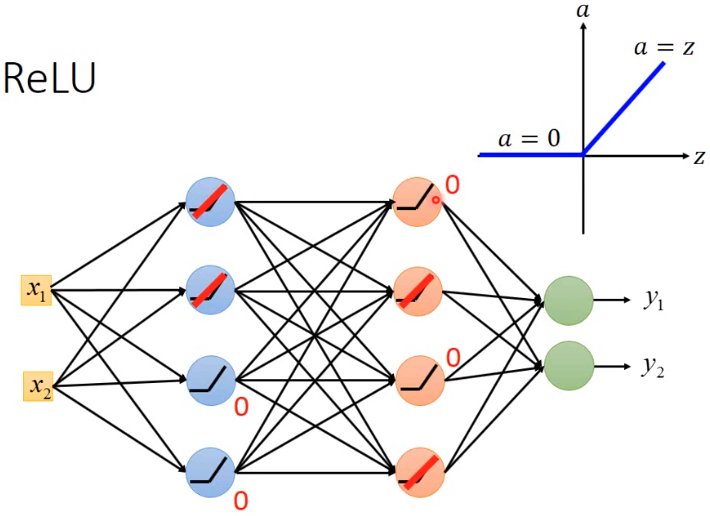

the output of ReLU is 0 or input. when output is 0, the neuron won't affect the next layer, so we can simply remove these neuron. in this way, the whole network become a thinner linear network.

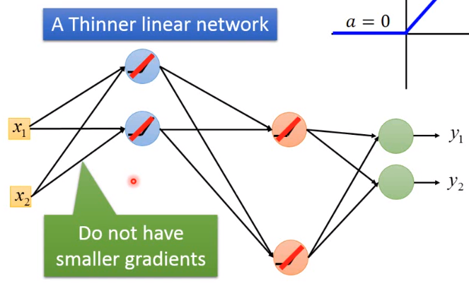

on the other side, meanwhile ReLU's output equal to input, the influence of the near-input parameters will not vanish.

### Is ReLU network a linear model?

no, if you change input so dramatically that the region of neuron's operation changes, the whole network  is nonlinear.(即改动大到某些神经元输入的区间从负变成正，output从0变非0，network structure changed)

### ReLU-variant

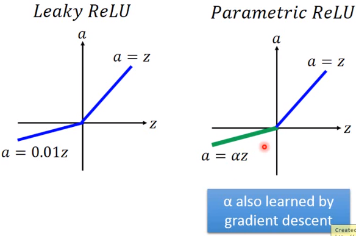

 when input is negative, the output of ReLU is 0, the gradient is 0, we cannot update parameters using gradient descent in this case.

to handle this problem, Leaky ReLU and Parametric ReLU is proposed.

### Maxout

#### ReLU is a special case of Maxout

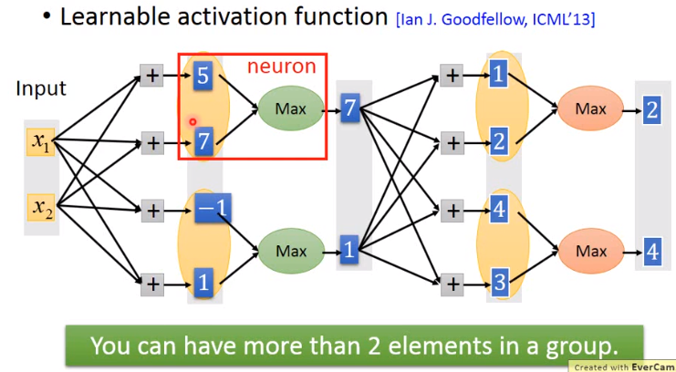

z=wx+b, while Maxout divide the zs in groups and choose the maximum as output among every group. 

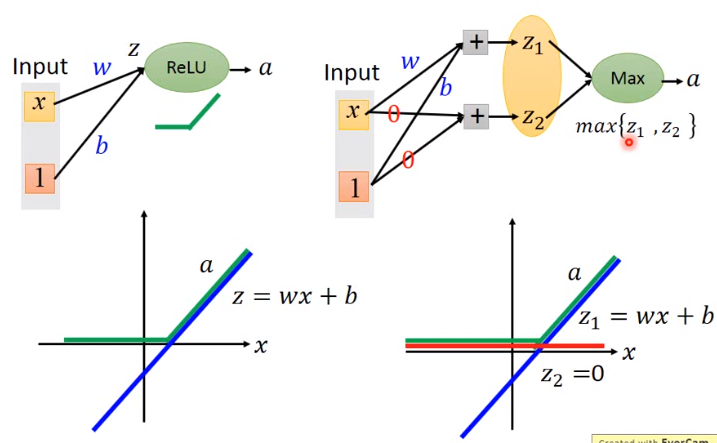

when the w and b of z2 are 0, Maxout become ReLU

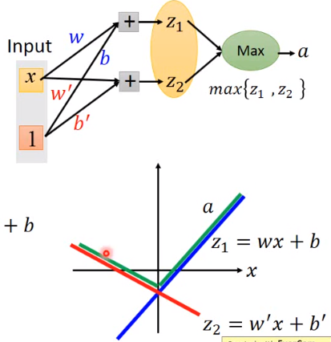 

but, Maxout is more than ReLU. it is learnable and depends on the parameters.

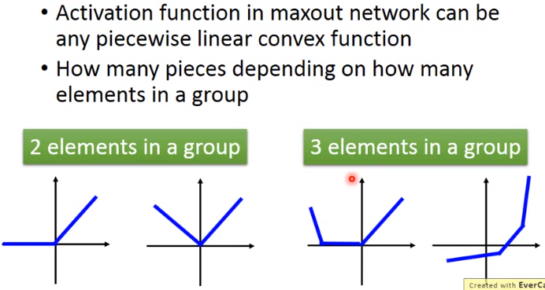

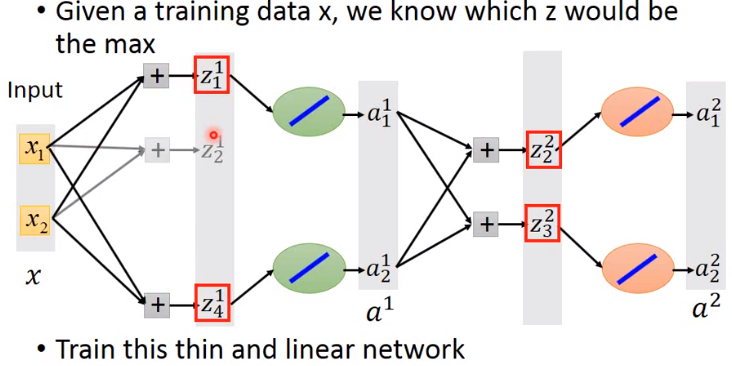

while training the network, the network structure depends on the input. given a training data, only part of neurons are trained. but  on the whole training set, all parameters will be trained.

### Review of Optimizer(Adaptive Learning Rate)

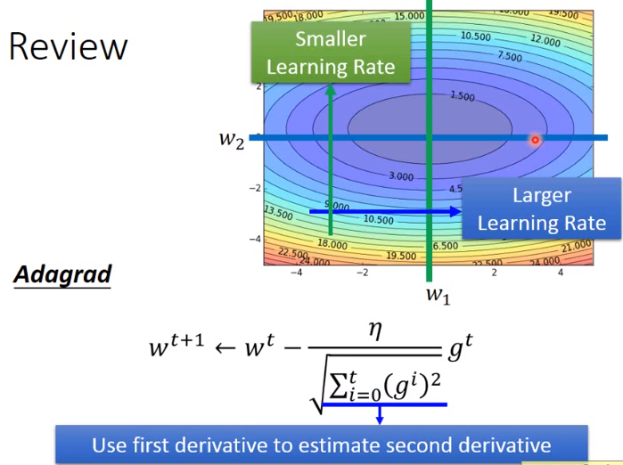

Adagrad: with respect to different parameter(weight), when gradient is large, learning rate should be small. when gradient is small, learning rate should be large.

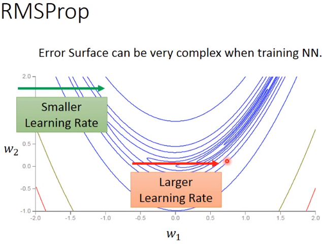

but, adagrad is  not enough. in the process of changes of a given weight itself, learning rate should be adjustable.

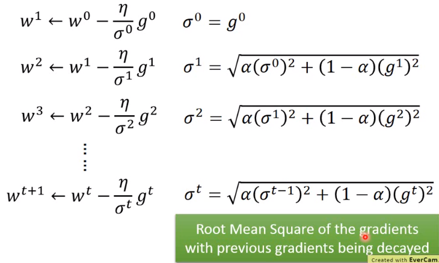

setting the alpha, we can control the weight of previous gradients.

### consider the local minima problem

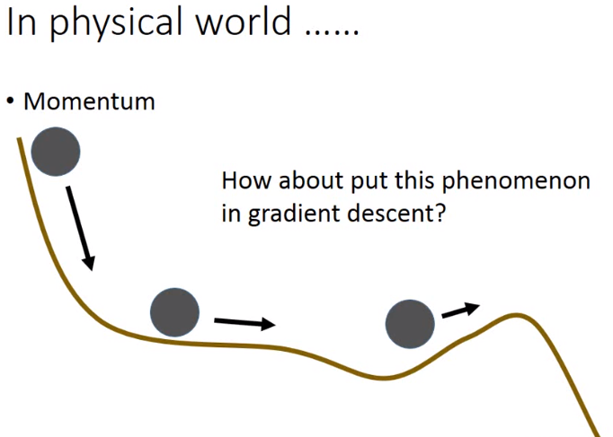

in physical world, momentum could help a ball get out of a local minima.

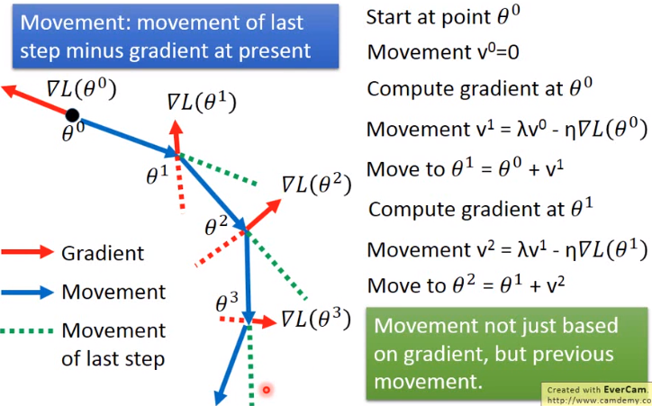

green dash line represent the movement direction, red dash line represent the gradient direction.

vi is actually the weighted sum of all the previous gradient.

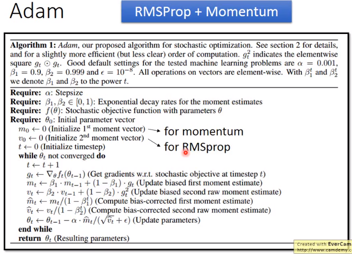

### Early Stopping

the distribution of Total Loss on Testing set(actually Validation set, because validation set is your reference to modify your Model) and Training set are always not the same. so, you should stop your training before your Total Loss increase on your Validation set.

### Regularization

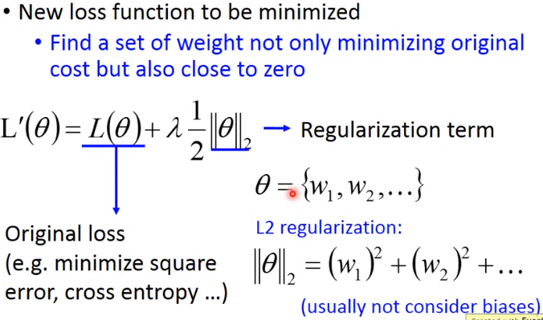

the purpose of adding L2-norm is to make the function more even and smooth.

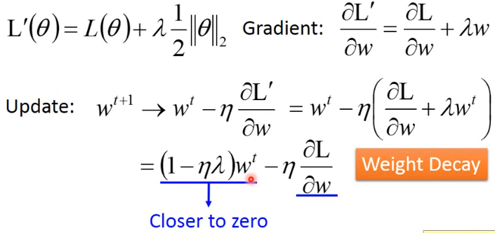

the 1/2 before the L2-norm is multiplied for derivation. after derivation, 1/2 will vanish.

according to the formula, (1-eta*lamda) before the weight is to keep the weight closing to zero. in updating, weight will keep decaying.

### we could also use L1 regularization

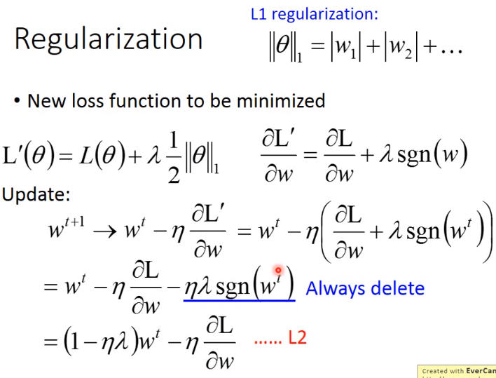

L1 is always deleted as a solid number to make weights closer to zero. compared to L2 which is multiplied before the weights, L1 regularization can't make weights that close to zero like L2. the result of L1 regularization is always sparse. for some task, sparse result is better. in that case, we should use L1regularization.

### Dropout

### 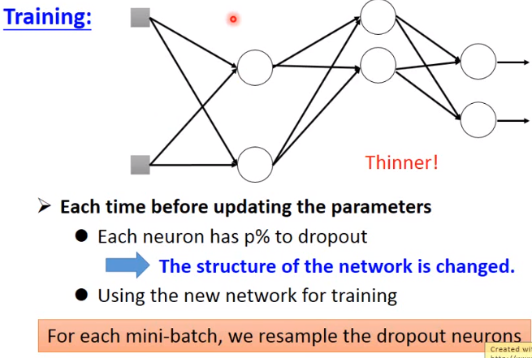****  

each time before updating the parameters, dropout some neurons.

the next time before updating the parameters, resample some neuron and dropout them.

dropout will decrease your accuracy on training data.

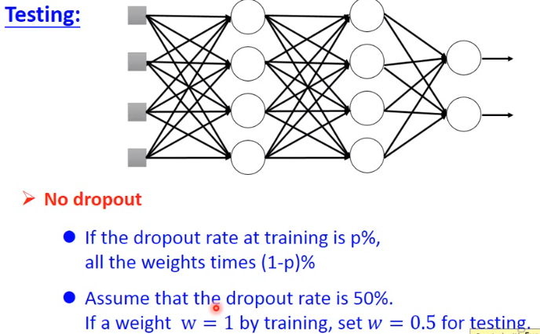

#### Why dropout make better performance on testing data

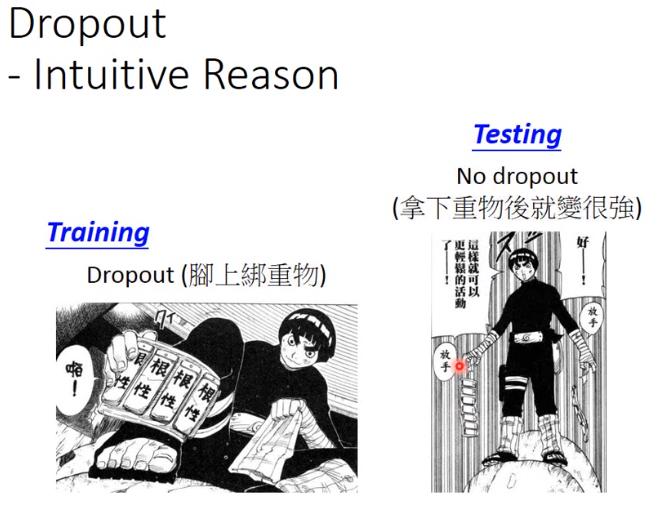

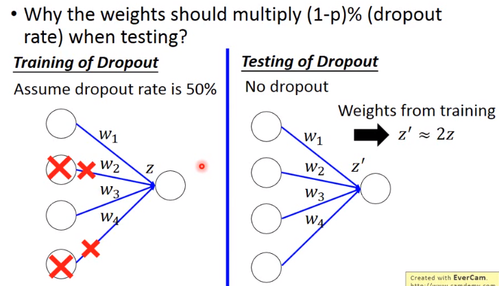

#### Dropout is a kind of ensemble

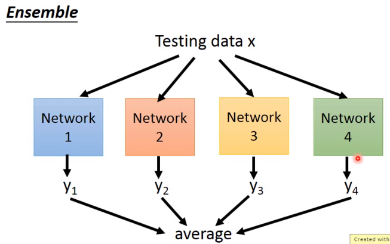

dropout is like to train multiple networks when your network is trained on training set.

when test your network, the multiple networks is like to be resembled and become a powerful network.

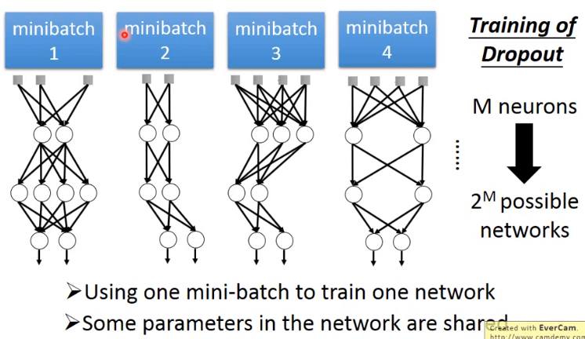

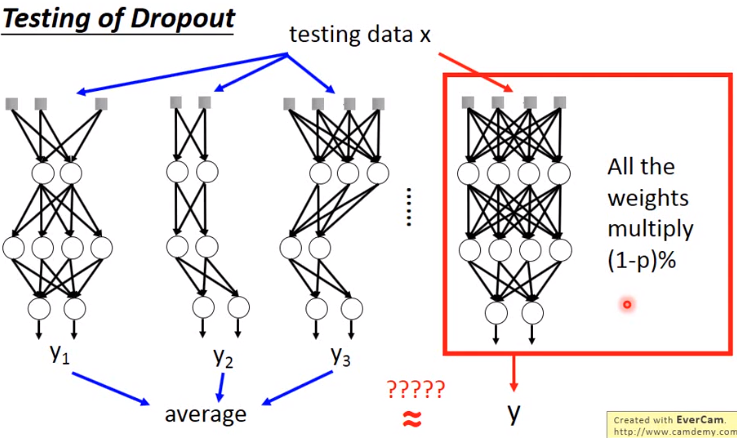

the average of results of networks approximately equal to the result of the whole network with all the weights multiplying (1-p)%

## Why Deep

someone proposed that if only your network have a large enough number of parameters, even though there is only one layer in your network, the network could perform well enough. so, why  deep?


fat network cannot have as good performance as tall network.


one-layer network is bad, because when we have little data on one class, we can only train a weak classifier.


but if  we divide the network into layers, classify task will be easier for the last layer.


### Modularization——Speech


people's pronounce on one word is always affected by the words next to it when you speech. we connect phoneme with the phonemes next to it and call this structure tri-phone. we can also define different states on one tri-phone, but how many is totally up to developer himself.


before DNN proposed, we used HMM-GMM

but there are too many states, this method is hard to implement.


to modify this method, we use tied-state to simplify the models.

another problem was found: In HMM-GMM（隐马尔科夫-高斯混合模型）, all the phonemes are modeled independently, but actually they have connections.


the horizon axle is tongue position. the vertical axle is tongue altitude.

so many phonemes, so many models, this is not efficient. but if we use DNN:


### All in All


### End-to-end Learning


in DL, each function in function set is very complex, like a collaboration of many simple funcitons.


DL is easier, but not means perform better. actually, until now, the best DNN can only achieve as good results as shallow approach. 


with respect to these phenomenons, we need many hidden layer to align these data step by step, make dogs  similar to dogs, train similar to trains.


these are graphs of layers' output. 手写数字辨识——classify layer by layer.

## Convolutional Neural Network

### Why CNN for Image

the target of CNN is to simplify the Neural Network. CNN need less parameters when it comes to image.


neurons detecting the same patterns in different regions can share the same set of parameters.


subsampling: remove the odd rows and even columns of pixels to make image smaller, so we need less parameters for the network to process the new image.


convolution is used because:

- Some patterns are much smaller than the whole image
- The same patterns appear in different regions.

Max Pooling is used because:
        Subsamping the pixels will not change the object.


the larger the number, the more likely to the pattern.


### convolution v.s. Fully Connected


if we regard every node in the feature map as a neuron, convolution is actually a not fully connected network! 

let's reshape the 6*6 image into a vector which could be regarded as the input of a neural network and the filter is the weight matrix.


moreover, because we use the same filter(actually weight matrix) to all the image windows. so actually, the neurons share the same parameters.

that means we need even less paramters!

### Max Pooling


divide the output of convolution into groups, and reserve the maximum or the average of each group. this process is max pooling.


### finally...


### quiz: after many times convolution, will the image have more and more channels?

nope. assume you have 2 filters, the output of the first convolution will have 2 channels. in the second time convolution, we should use two two-layer filers, the output will still be 2 channels.

### Flatten


Flatten: reshape a image into a vector.


mention: in the second convolution, every filter is 25\*3\*3, number of parameters for each filter is 25\*3\*3=225, because filter is 3*3, so convolution's output's corresponding dimensions minus 2(e.g. before: 50\*13\*13, after: 50\*11\*11).


### What does CNN learn?


define activation degree of tha k-th filter: ak. use gradient ascent to find a input x (namly, an image) to maximize the activation of each filter(actually, find the image like each filter the most). result as follow:


we can find that each filter is actually detecting a kind of patten(texture) in the input image.


whereas, in fully-connected network, use the same method(maximize the activation), we can find that each neuron is detecting a complete figure instead of texture.

when it comes to the output layer, the results of maximize the activation of each output(0,1,2,...,8) is:


it seems that we can understand how can CNN recognize the digits in these images but, if we minus a regularization in activation formula, we can roughly recognize the digits.(the following image is not correct, the plus should be minus)


### Deep Style


train a CNN that can extract the content of an image(output of filters) and then train another CNN that can learn the style of an art(we reserve not the output of filters, but the co-relation between the outputs)

then, if we train a CNN, the output of its filters is like the first CNN and the co-relation between its filter is like the second CNN, we can transform a image into another style.

### More Application: Playing Go

if we use neural network, the input should be a 19\*19 vector. to use CNN, we just need to input a 19\*19 image.

### under what circumstance, we should use CNN?

if one white piece is surrounded by the black in three directions, we could come to a conclusion that the next white piece should be placed on the last direction and there is no need to look over the whole chessboard.

play chess do not need max pooling.

spectrogram: the frequency distribution of a recording of speech. trained people can recognize the content of the speech out of the spectrogram.

we input a part of spectrogram into CNN, filters only need to move in the frequency direction because the frequency of different people saying the same content is different, but the pattern is the same. as a result, we move filters on the frequency direction is meaningful, but moving on the time direction have no meaning.

CNN on 文字处理: use CNN judge a word sequence is positive, negative or neureal。if the input is a sentence, we should put each word into a vector, these vectors make up the sentence matrix. when we train CNN on this matrix, we only move filters on the word sequence direction because there are relations between two words but moving on embedding dimension is meaningless(every embedding dimension is independent).

## Graph Neural Network

### Graph

node+edge

### HOW TO DO

### Generalize convolution from image to graph, how?

### Spatial-based Convolution

### NN4G

其中：
$$
h^0_3=\overline w_1\cdot x_3
$$

### DCNN

### MoNET

### GAT(Graph Attention Networks)

### GIN(Graph Isomorphism Network)

the first row means: the update of node v on k-th layer should be k-1-th layer plus sum of neighbors.

the second row explains why plus sum rather than mean or max. because mean and max both cannot recognize the difference between the two graph.

### Spectral Graph Theory

太难了，不看了

## Recurrent Neural Network

### Example Application

develop a ticket booking system that can identify the destination phrase and arrival time phrase in  costumer's word.

### we can use feedforward neural network

first, we need to represent each word as a vector. we could use **1-of-N Encoding**

 

what if we encounter a word not belonging to the lexicon? we need to add a dimension "other" in our vector.

but if we use word hashing, we can represent any word.

on the other hand, the output of the neuron network should be the probability distribution that the input word belonging to the slots.

but this is far from enough because 'Taipei' not only could be destination, but also can be the place  of departure. in order to identify whether 'Taipei' is destination or departure, the neural network needs memory of 'arrive' or 'leave'.

### Recurrent Neural Network have 'memory'

#### When use RNN on testing data: RNN will keep the memory of the last word.

### Elman Network & Jordan Network

Jordan RNN use memorize the output of the last word.

if we combine a forward direction(the word sequence)and a backward direction (from the last word to the first word) RNN's hidden layers with a output layer, we can get a Bidirectional RNN that can consider the context at the same time.

### Long Short-term Memory(LSTM)

mention: long的short-term memory

1 neuron have 4 inputs: input and 3 gate-control signal

In practice, the input gate, output gate, forget gate use the same input vector, but they have respective weights and bias.

最后得到的y会是00070

### Neural Network v.s. LSTM

LSTM needs 4 times of parameters of neural network that have the same quantity of neurons.

Keras supports "LSTM", "GRU", "SimpleRNN" layers

### Review our Learning Target

input is sentence，output should be each word's class. we adopt cross entropy as Loss Function.

### Learning Stage

#### Backpropagation through time(BPTT) 

we still use gradient descent to train RNN, but RNN have its own compute method BPTT, which is similar to Backpropagtion.

### Unfortunately, RNN is hard to train

when Loss function come across a cliff, the gradient will be really large and the learning rate can not response immediately and is still large. As a result, the parameters of loss function will go too far.

let's explain the case in another way, small change of parameter w can cause huge influence on y when w>1, but the influence turn out to be super slight when w<1. In this case, Definition of Learning rate seems to be really hard. this phenomenon refers to as**gradient explode and gradient vanishing.**

### Helpful Techniques

LSTM can handle gradient vanishing. because the influence of w will be memorized to affect the next LSTM.(actually, forget gate is hardly open.so don't worry that memory will be cancel)

LSTM's simpler version is GRU,which connect the input gate and forget gate and thus it needs less parameters.

### RNN can do much more than identify destination

### 'Many to one' task

#### 'Many to Many (Output is Shorter)' task

trimming will remove the repeat words in speech recognition, but when the speech actually repeat the same word, how can we handle this?

#### 'Many to Many (No Limitation)' Task

when input 'machine leaning' to RNN, the first output should be '机', then use the memory 'machine learning' and the last output '机' as input, the next output should be '器'. the problem is the network do not knew when to stop.

we should add an probable symbol'===' in output

#### Beyond Sequence

input the sequence of a sentence, and the output is a syntactic tree.

####  Sequence-to-sequence Auto-encoder-Text

implement an Auto-encoder that can turn a word sequence into a vector(encode), and can decode the vector to a word sequence.

training this RNN do not need labeled data, just input documents and the output should be the same document.

four layer network: encode word sequence to sentence sequence and to vector, decode to sentence sequence to word sequence. 

#### Sequence-to-sequence Auto-encoder-Speech

application: Spoken query(语音搜寻，在一段语音中搜寻一个词), transform the need-to-query audio segment to vector, then compare the vector with the vectors of the Audio archive.

but, we can not just train an encoder(need large amount of labeled data), we have to train a decoder simultaneously. in this case:

#### Chat-bot

input: speech from chat-bot's master. output: the sentence bot should say.

training data: sentences from TV show, drama 

### Attention-based Model

people can remember things happened long long time ago. what if machine have this feature?

#### Reading Comprehension

firstly, through semantic analysis the network can have large amount of memory of vector. then, for any query, DNN/RNN use Reading Head Controller to find the answer with regard of the meaning of the query.

#### Visual Question Answering

DNN/RNN to analysis the meaning of the query and inform the reading head controller to find the answer.

#### Speech Question Answering

attention take responsibility of  finding the answer.

### RNN v.s. Structured Learning

most of structured learning is linear. so if you want to get state-of-art performance on sequence 雷人的task, deep learning is necessary.

#### RNN and Structured Learning can be Integrated

adopt RNN's output as the input of Structured Learning.

in Speech recognition, the most state-of-art result come from the hybrid network.

the specific integrate method is illustrated in the upper image.

use RNN to extract features, and use these features to construct Structured Learning.

this have been applied on 'word generate image' task, input x is a sequence of words, the output of the generator should be an image, and the discriminator take responsibility of judge whether the words image pair is true.

**Deep and Structured will be the future**

## Semi-supervised Learning

### Introduction

unlabeled data>>labeled data

use testing data without label to train model is not cheating, which is called transductive learning.

we assume that unlabeled image is cat and get the classification model, but actually no one knows  whether the image content is a cat.

use prior probability P(Ci) and mean and covariance, we can compute posterior probability P(Ci|x) which means we have got decision boundary.

the specific steps: 

first initialize the P,mu,sigma. 

then compute the posterior probability with initial parameters, 

then use labeled and unlabeled data to update the model (in formula of P(Ci), Ni is the number of  labeled data, the second part is the probability sum of unlabeled data. we adopt the posterior probability compute  by labeled data as the probability of unlabeled data), the calculation of mu and sigma is the same as P(C1), the second part is unlabeled data

then compute the posterior probability. iterate until the algorithm converges.

## Unsupervised Learning

### what can Unsupervised Learning do?

- Clustering & Dimension Reduction
- Generation

### Clustering

1. intialize K centers(randomly choose K objects from X)
2. for all xn, xn belong to the most close center
3. sum all the objects belong to ci/quantity of objects(namely, compute the mean of objects belong to ci as the new ci)

build a tree: find the closest pair among all examples. set the mean of the example pair as the root of the pair. find the closest pair among the root and other examples. repeat the process until the tree complete.

### Distributed Representation（Dimension Reduction）

Clustering太片面了，强行把一个example归为一个cluster，忽视了它的其他可能

Distributed representation把一个example用多个attribute来代表，不仅更全面，也达到了化繁为简的效果。

### Why Dimension Reduction Work

Many information looks like 3-D are actually 2-D.

### Dimension Reduction Method

- 最简单的方法是feature selection，即观察样本的分布，发现在feature x1上各样本的值区别不大，所以去掉这一维

- PCA要找的function是一个Linear function，要做一个线性变换把x变成z，具体细节可以看Bitshop, Chapter 12

### PCA

其实PCA要找的就是W，下面考虑一个最简单的情况：reduce to 1-D，即z是一个scalar，那么W就是一个行向量。这里要假设w的长度是1，即2-norm是1。x是高维空间中的一个点，w是高维空间的中的一个向量，那么x和w的内积z就是x在w上的投影。现在要做的就是把所有的x都投影到w上得到一系列的z

假设x在二维空间的分布如图所示，如何选择w呢，我们希望投影之后，数据点之间的区别仍然能被看出来，所以z的variance越大越好。

假如我们不想z仅仅是一维的，我们可以再找一个w，让x在它上面做投影，这样就可以得到z2，条件还是z2的variance越大越好。但是我们不能再用z1的w了，所以要加一个条件，w2必须满足和w1正交。

把这些w合并成一个矩阵，就是一个正交矩阵

怎么去求这样的w呢，可以用拉格朗日乘子法：（也不一定非要用这种方法，你甚至可以梯度下降）

Var(z1)的第3个等号右边式子到第4个等号右边式子的推导，通过右边(a.b)^2的推导给出。蓝线框出的式子是X自己和自己的协方差。

右边(a.b)^2的第三个等号的推导是因为aTb是一个scalar，所以将其转置不变，可以直接加T。

要去maximize最终推导出来的wTSw，其实很简单，只要让w的每个元素都是无穷即可，但这显然不是我们要的结果，所以给出一个限制，w的二范数必须为1

#### wi其实是按对应特征值从大到小排列的特征向量

下图蓝框上面是条件，蓝框内是S的特点，红框内是结论：要找的w1就是x的covariance matrix的最大特征值对应的特征向量

symmetric：对称的，positive-semidefinite: 半正定，non-negative eigenvalues：非负特征值

推导过程用Lagrange multiplier

首先要构造一个函数g，其中alpha是参数，前一项是要maximize的对象，后面乘alpha的是条件。

然后要把g对w的每一个元素求偏微分，令其为0，整理后得到右边第一个式子，移项发现w1就是一个特征向量，把这个式子左边同乘w1的转置，又因为w1Tw1即w1的长度是1，所以w1TSw1等于alpha，而w1TSw1就是要maximize的对象，所以alpha要最大，只能取最大特征值。

对w2也同样用Lagrange multiplier，多了一个条件w2与w1正交。微分后整理出来的式子中，alpha和beta的项根据条件分别为0和1，对第一项进行变换，第一项是vector乘matrix乘vector，结果是个scalar，所以可以加转置，展开后因为S对称，所以可以去掉转置，Sw1=lamda1w1，然后w2与w1又正交，所以第一项等于0，所以beta=0，所以w2是特征向量eigenvector，为了maximize选第二大的特征值对应的特征向量。

### PCA可以把数据变成Decorrelated Data

z的covariance matrix其实是一个对角矩阵 (Diagonal matrix /daɪˈæɡənl/), 这意味着z在不同维度之间是无关的（协方差矩阵是对角阵意味着，不同维度之间的covariance=0，相同的非零），这对于把数据进一步处理是很有用的，因为对于维度之间无关的数据，要用一个model去拟合是要更容易的，所以把PCA处理过的数据作为你训练模型的输入会起到好的作用。

怎么证明z的协方差矩阵是对角的呢，有上面的推导。z的协方差展开整理后可得WSWT，把WT拆成列向量组其实就是w1, w2...(因为W是把w1，w2等转置成行向量在垒起来的)，把S乘进去，可以变成特征值乘特征向量，再把W乘进去，Ww1其实是W乘自己的第一行的转置，而W的每一行是特征向量，不同特征向量乘起来是0，所以最终乘起来是对角阵。

### PCA: Another Point of View

假如我们要对一堆手写数字进行降维（表示），一个手写数字可以由K个Component来表示，K个Component可能是一些笔画，那么7就能表示成一个向量[c1, c2,..,cK]，写成公式就是x等于K个Component的线性组合加上x的平均（所有images的平均）。把images的平均移到等号左边，我们把这K个Component的线性组合命名为x_hat.那么我们要做的就是尽量使x_hat与x-x_ba接近，他俩的差值我们命名为reconstruction error（重构误差）。

我们观察下图最上面这个公式，这时我们可以想到用PCA来解。x-x_ba就是z，而Components ui就是wi，c可以组成x。我们现在要minimize两者间的error。

其实可以用SVD奇异值分解来分解Matrix X，分解出的U就是component矩阵，sigma和V的乘积就是c矩阵，而奇异值分解的U就是协方差矩阵的两两正交特征向量求出来的。

假如w1, ..., wkj就是component，那么因为w之间是正交的，要最小化error，c应该等于x-x_ba与w做内积。

这样一来就非常像Neuron Network，输入是x-x_ba，输出是x_hat, input multiply w equals to c, c multiply w equals to x_hat.我们甚至可以用梯度下降去求w，但是求出的w不会是PCA的w（因为很难会正好正交），最后minimize的结果也很难和PCA一样，但是Neuron Network是可以加深的，Deep autoencoder 就可以获得好的结果了。 

PCA的缺点：

无监督，假设要把一组二维的数据映射到一维，PCA会选covariance最大的一个维度。即便如此，假如数据的类型其实不是按covariance最大来分的，而是按下面这个方向，那么用PCA做，在映射之后就会把两类数据混在一起。所以这时还是需要引入label，用有监督的LDA（Linear Discriminant Analysis，线性判别分析）来做

线性，像上图这样一个在空间中S形叠起来的数据，要用PCA把它拉直，是不可能的，PCA会把它拍扁，数据会混杂在一起，这个得用非线性降维来做

### Application-Pokemon

这是一个PCA的应用，我们要对这800个数据降维，应该降成几维？

我们把这些数据的协方差矩阵算出来，再求出特征值，然后把特征值从大到小排序，去求每个特征值在特征值总和中占的比率，占得比率大的，说明映射后的covariance大，这里前四个的比率比后两个大很多，所以可以选前四个components.

这四个Component代表了什么呢，PC1 6个属性全都是正的，这代表着宝可梦的强度，PC2防御最大，速度是负的，当你用这四个Component去表示一个数据时，假如PC1的权重越大，说明这宝可梦能力越强，如果PC2越大，说明这宝可梦越侧重防御而牺牲了速度。

观察数据在PC1和PC2这两个维度上的分布可以看出是一个椭圆形，这也可以看出两个维度是无关的。

http://speech.ee.ntu.edu.tw/~tlkagk/courses_ML20.html

链接：https://pan.baidu.com/s/1Rx87uRwFe0y6qSI9v61Ghw 
提取码：xwgu
置顶评论上找到的

