# machine learning with Li Hongyi

## Optimization for DL

### What you have known before?

- SGD
- SGD with momentum
- Adagrad
- RMSProp
- Adam

### Notations

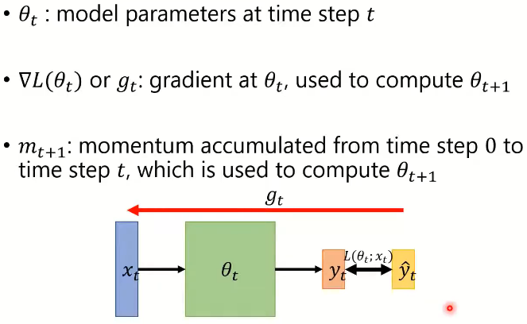

### On-line vs Off-line

on-line: 一个time step只能获得一个训练样本计算出y，然后求得Loss

off-line:一个time step可以把所有训练样本放入模型，得出y计算Loss，这是理想情况，之后所有讨论都是基于这个假设

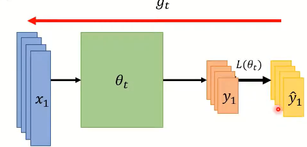

### SGD, stochastic gradient descent

每个time step往梯度的反方向走

### SGDM, SGD with Momentum

每个time step的movement都要加一个momentum向量，来避免梯度消失

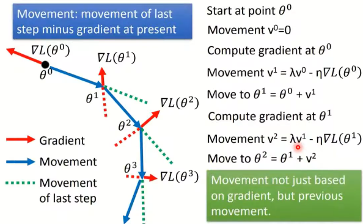

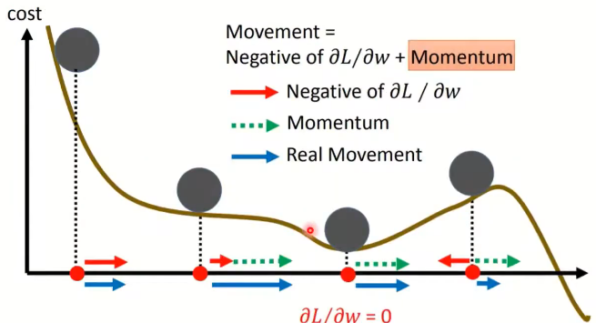

momentum即上一步的movement，当某一点梯度接近零时，由于有momentum加入，移动得不会特别慢

### Adagrad

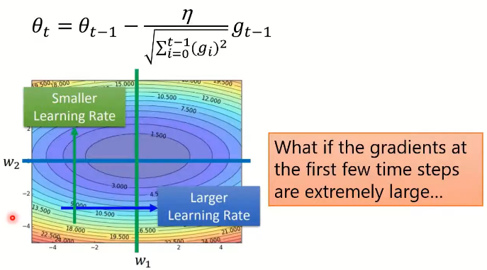

learning rate要除以之前所有梯度的平方和的开方，这样假如之前梯度特别大，下降的步子就会小一些（陡峭的地方不要冲得太猛），假如之前梯度特别小，下降的步子就会大一些（平缓的地方走的快些）

### RMSProp

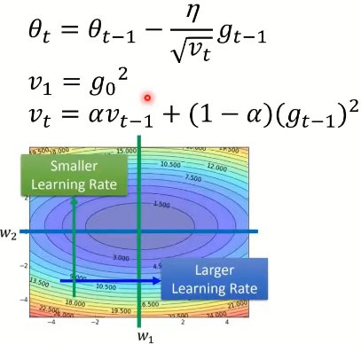

避免Adagrad中learning rate要除的那个数无止境增大，引入alpha，对上一步的梯度和之前梯度的平方和做一个平均。

### Adam

以上方法还是没法解决在梯度为零处停止的问题。

Adam其实是SGDM加上RMSProp得到的方法：

- mt代替梯度：mt由上一步的momentum和梯度加权平均，而真正用到的mt_hat，是把mt除以小于1的一个参数，来保证它在t小时足够大
- vt用来修正learning rate，vt同样除以小于1的一个数来保证在t小时足够大，vt_hat加上一个epsilon来保证一开始t=0的时候不会因为vt_hat=0，而使learning rate爆掉。

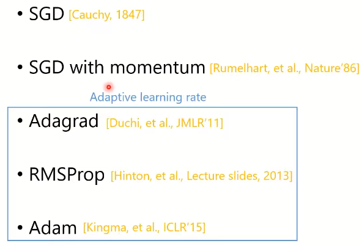

### 为什么14年之后没有更好的optimizer被提出来？

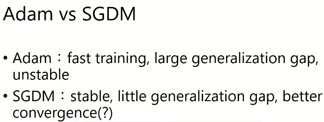

近年最优秀的模型几乎都是用Adam和SGDM训练出来的，Adam在训练集上表现最好，但是在validation set上SGDM表现最好，而且SGDM收敛得更好。

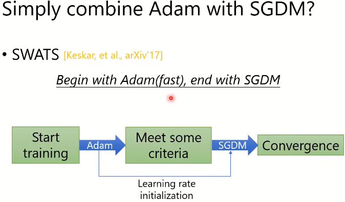

有人提出开始用Adam，后期用SGDM，但上中间切换算法时的规则很难制定。

### 改进Adam

假设前1000步的梯度都是1，突然有一步梯度达到了10000，这一步的learning rate由于前面的影响也只能达到10倍根号10的learning rate，这是adam的问题，在最后阶段，大部分梯度都极小，偶尔一些包含重要信息的大梯度也没法产生作用。

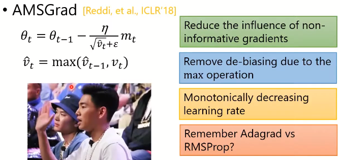

假如t-1的v_hat比t步算得的v大的话，t步的v_hat直接取上一步的v_hat，这样，假如有一步梯度特别大，那么后面的learning rate会很小，就凸显了大梯度的作用。但是这样做的话，learning rate会一直减小。只解决了小梯度得到大learning rate的问题是AMSGrad的问题

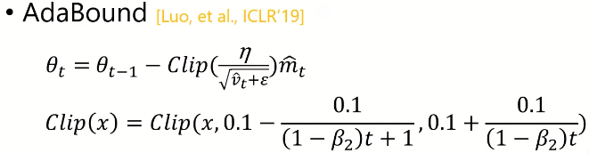

AdaBound给learning rate做了一个clip，给它设计了一个上界upper bound和一个下界lower bound。这样做失去了learning rate的自适应性，所以也不是最好的方法。

### 改进SGDM

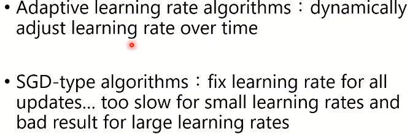

SGD类的算法不是自适应的，设置小learning rate就走得太慢，设置大learning rate就走得太快。怎么样找到最佳learning rate呢？

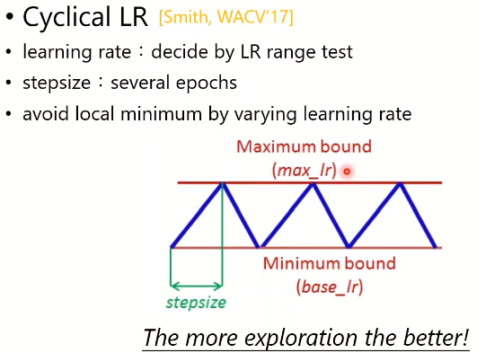

让learning rate在上下界之间反复循环，learning rate变大时，就是鼓励算法去探索，以更快地收敛。

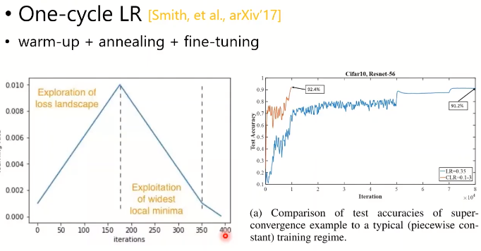

learning rate只做一个cycle，lr最开始一直上升（warm-up），直到到达比较好的local minima，就开始下降（annealing），最后进入微调直至收敛（fine- tuning）。

### Adam需要warm-up吗？Of Course!

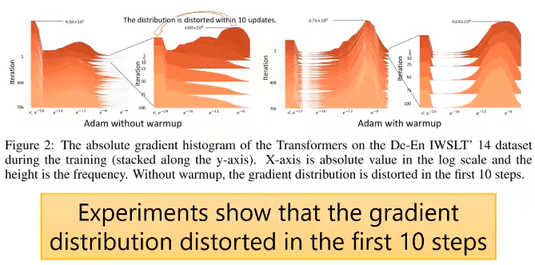

纵轴是iteration，可以看出没有warm-up时，前十次迭代的曲线与后面不同，横轴是梯度值范围，高度是此梯度值出现的频率，没有warm-up的话，在前10步（iteration: 1~10），梯度值是不稳的，有warm-up时，梯度值集中在一个区间上。

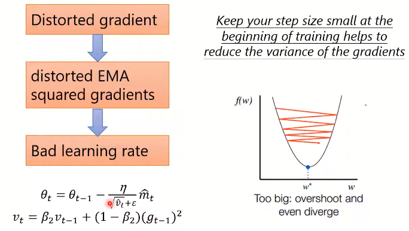

不稳定的梯度会导致不稳定的EMA，进而导致不准确的learning rate，learning rate假如暴走，会导致更严重的后果（如右上图所示），所以，我们至少可以在训练开始时控制learning rate小一些。

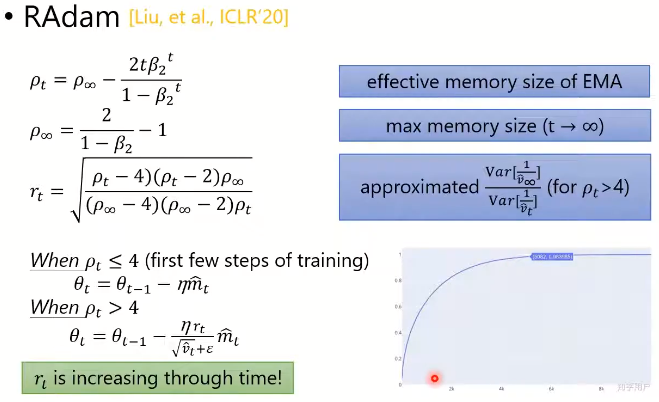

RAdam方法，前4步用固定的learning rate(SADM)，4步后在Adam的基础上乘以一个rt，这个rt完全依赖于ρ

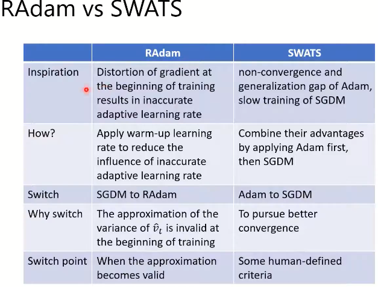

下面提出另一类方法：

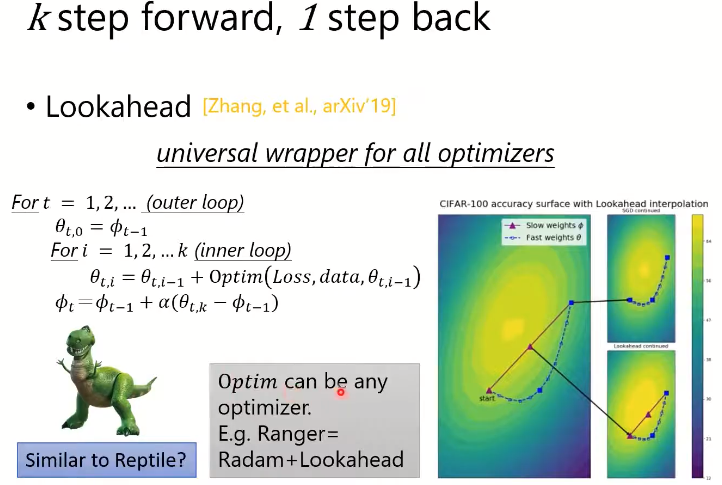

theta是fast weight，即用之前提出的任意方法走k步，然后减去最开始的点，用这段距离的alpha倍加上最开始的点，即为真正要走的1步。

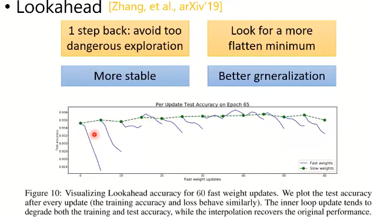

fast weight的走法会降低不管是训练还是测试准确性，而interpolation恢复了原始表现。

### Nesterov accelerated gradient (NAG)

momentum方法是有问题的，当函数下降到低谷时，梯度为零，但是动量仍有，所以不会停下，就会继续走，走到前面发现会上升，这时又会往回走，所以能不能预测到前面的路呢，于是就有了NAG法

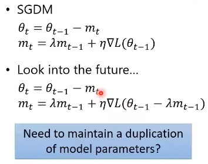

NAG在SGDM基础上，计算动量时把theta(t-1)的梯度改成了theta(t-1)的梯度减去t-1的动量，等于是用m(t-1)模拟m(t)，theta(t-1)-m(t)，这不就是下一步的位置吗，这个求梯度不就是下一步的梯度吗，这不就是预测了移动后的梯度吗，以这个梯度为参考，就能避免因动量产生的多余动作。

但是，这样就要维护两份model parameters，因为theta(t-1)其实就是参数向量，theta(t-1)-m(t-1)预测出来下一步的参数，然后计算梯度，同时因为还要用原始的theta(t-1)-m(t)来计算真正的下一步参数，所以系统要维护两份参数（theta(t-1)-m(t-1)和theta(t-1)），会占据大量空间。

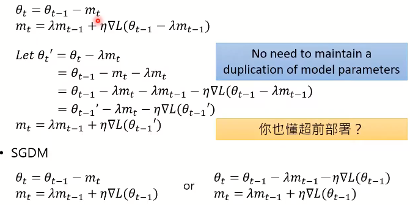

经过一系列的数学推倒，可以简化公式，使得NAG具体运用时不用维护多个momentum，节省空间。新公式就是SGDM上面的那两行，用thata'来代替theta

对比新公式和SGDM的公式，发现就是把第一行的m(t-1)换成m(t)，SGDM就变成了NAG

那么，把Adam中的m(t-1)也超前部署一下，就能获得超前的特性了：

### Nadam

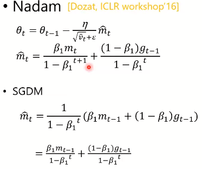

对比Adam的改进方法NAdam和SGDM的第一项，同样是梯度所在项不变，只改momentum所在项，就得到了Nadam

### 关于正则化项

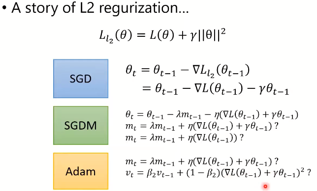

在实际使用是，我们往往要在Loss后面加上一个L2正则化项（注意，图里写错了，gamma前面应有个1/2），为的是让theta不要太大，theta太大，会容易陷入崎岖的深谷

但是，在SGDM和Adam的情况中，mt和vt是否要加上正则化项呢？

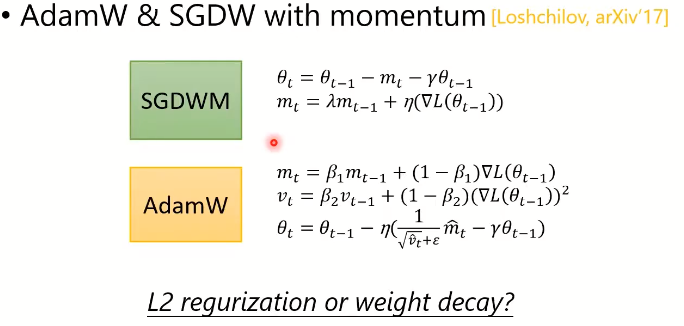

17年的一篇paper提出不要加，这两种算法是现今常用的算法，之前讲的都不常见（除非是专门研究优化算法的人）

### 几个优化时用到的小tips

1. Shuffling：data输入时不要按顺序输入，要随机输入

2. Drapout：神经元的输出如果没有意义就mute掉

3. Gradient noise：计算梯度时加上一个噪声

   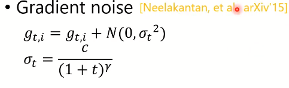

这几个tip其实都是为了鼓励优化算法去探索：The more exploration，the better！

1. Warm-up：一开始learning rate比较小，等稳定之后再调大

2. Curriculum learning：先用简单的没有噪声的数据去训练，找到大概的位置（平缓的local minma），再用难的数据，这样可以避免掉进深谷。

   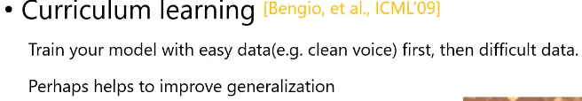

3. Fine-tuning：用网上找到的已经train好的model，在这些model的基础上用自己的方法去train，可以省事。

### All in All

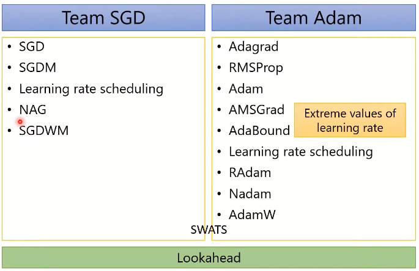

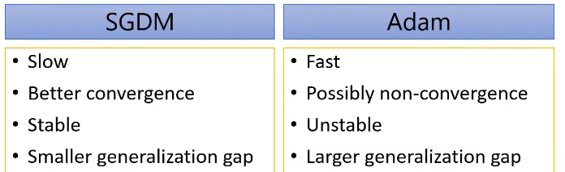

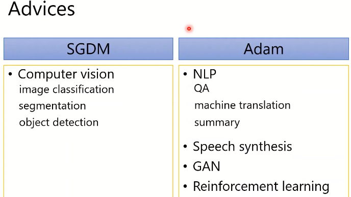

没有万能的optimizer，而且假如你的模型训练的不好，也往往不是optimizer的原因，往往是你的数据不好，架构不好或者训练技巧不好。

## Classification

### How to do Classification

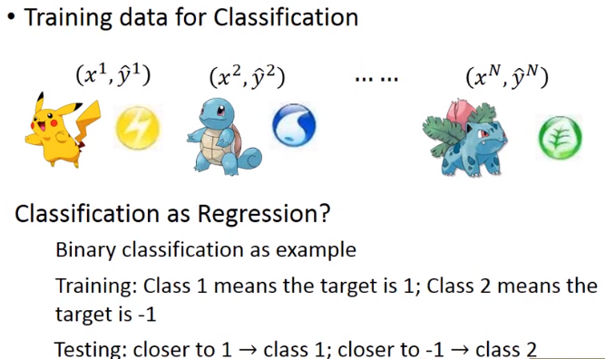

可以用回归的方法来解决分类问题吗？把一类看做1，另一类看做-1，回归的结果接近1就看做第一类，接近-1就看做第二类。这样其实是有问题的：

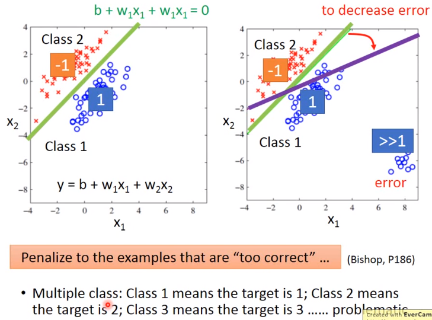

假如训练数据中有远大于1的数据，那么最终回归的结果会是紫色那条线，但是对于分类问题，绿色那条线才是正确的，即，“过于正确”的数据也会影响结果。

而且，在多分类问题中，比如三种类型，就用1，2，3三个数字来代表，这等于无意中在这三种类型间建立了关系，但是类型间其实是没有这样的关系的。

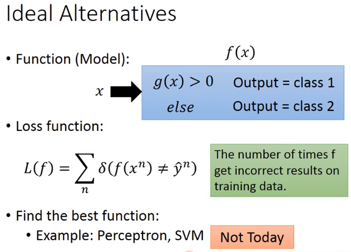

理想的训练方案是：模型f(x)包含g(x)>0则分为第一类，否则第二类。Loss function是分类错误的次数，寻优方法有Perceptron，SVM等（无法用之前讲的回归中用的梯度下降等方法（损失函数无法微分））

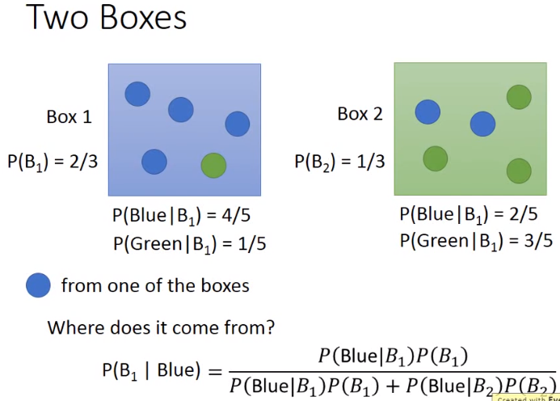

从盒子中抽出一个蓝球，是来自Box1的几率=B1抽出蓝球的几率乘从B1中抽球的几率/从B1中抽球且是蓝球的几率+从B2中抽球且是蓝球的几率

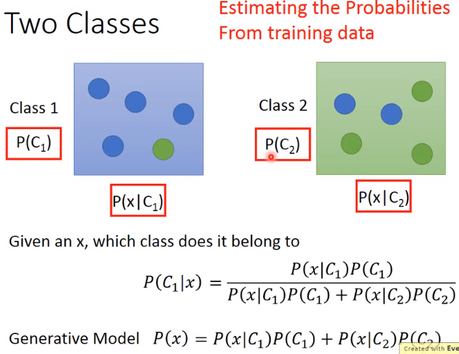

二分类问题与刚才的抽球问题一样，假设有两个class，x是某一个数据，比如说x是蓝的（即数据的属性），二分类问题就是判断这样一个蓝球究竟是c1还是c2，同样是计算概率，假如P(C1|x)>P(C2|x)就判断x属于class 1，反之class 2。

为了得出需要的概率，我们必须设法计算出红框中的四个概率，通过这四个概率，我们可以得到一个Generative Model（即用全概率公式计算x出现的几率），这样我们就可以自己产生x

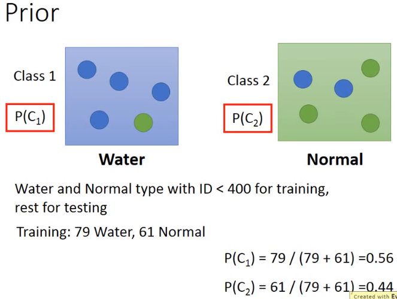

宝可梦水系和一般系，计算从水系抽的概率和从一般系抽的概率，很简单，所有宝可梦中，水系有79只，一般系有61只

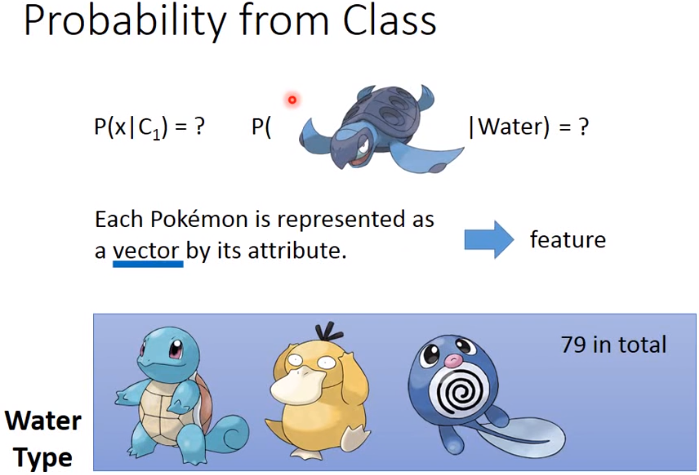

每一只宝可梦都可以用属性向量来表示

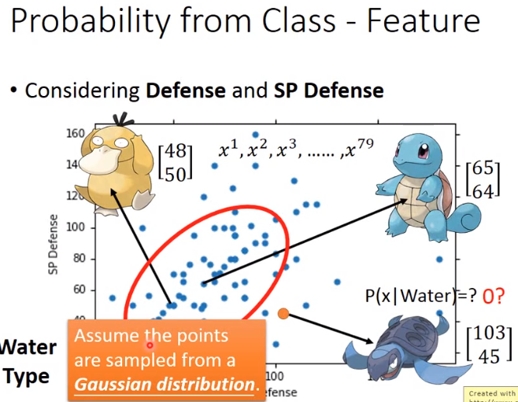

假设只有两种属性，那么水属性宝可梦的分布如图，假如杰尼龟和可达鸭是training data里面的，我们可以知道他们的概率，可是假如有个海龟，我们知道它是水属性，但它不在79只宝可梦里，怎么估计它的概率呢？

我们假设这些样本服从高斯分布

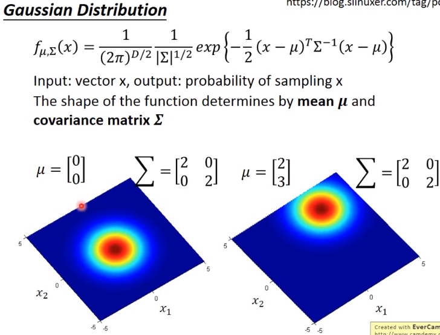

高斯分布：输入是向量x，输出是x的概率密度（这里为了好理解写成概率，其实两者是成正比的），公式由均值μ和协方差矩阵sigma决定，mu决定圆心位置，sigma决定圆的大小

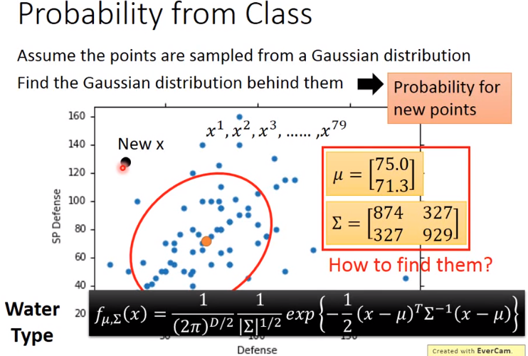

假如从样本的分布中看出mu和sigma，就能得到样本的高斯分布（离中心点越近概率越大），通过高斯分布的式子就可以计算出新点的概率，那么怎么计算mu和sigma呢？

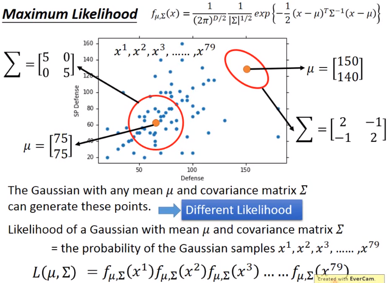

使用极大似然估计：不同的mu和sigma得出的高斯分布是不同的，而高斯分布的likelihood=每个样本出现的概率的乘积

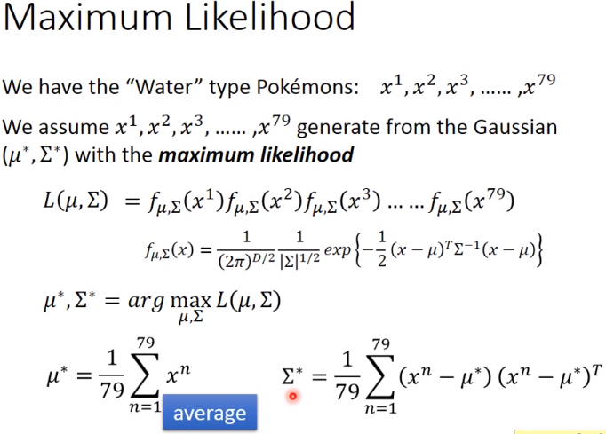

79只已知宝可梦决定的高斯分布的极大似然估计就是：找到让likelihood最大的mu和sigma。

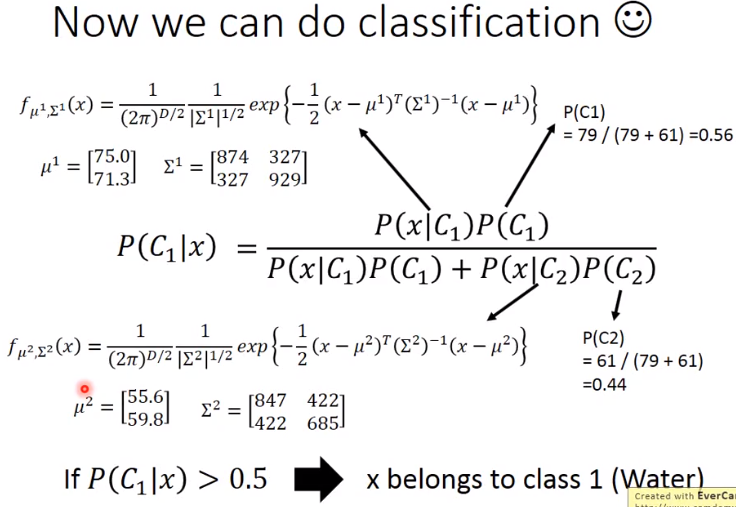

现在可以做分类了，x是C1类的概率大于0.5就属于C1.

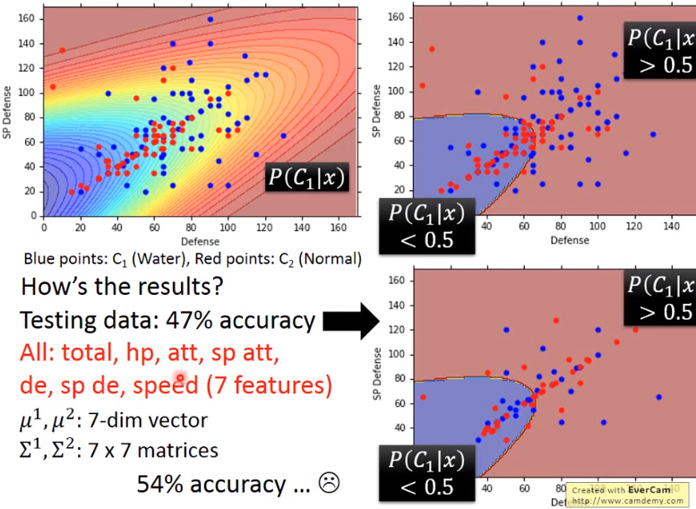

右上图是得出的预测模型，测试后准确率只有47percent，把特征扩展到七维，准确率也只有545percent。

这里高斯应该是模型，然后极大似然应该算是一种优化方法？

改进模型，两个模型用不同的sigma是不合适的，sigma和输入数据的特征数的平方成正比，即输入向量的维数越高，sigma增长的会非常快，会容易overfitting（越复杂的模型越容易overfitting），所以用一样的sigma就可以用更少的参数（即feature数）了

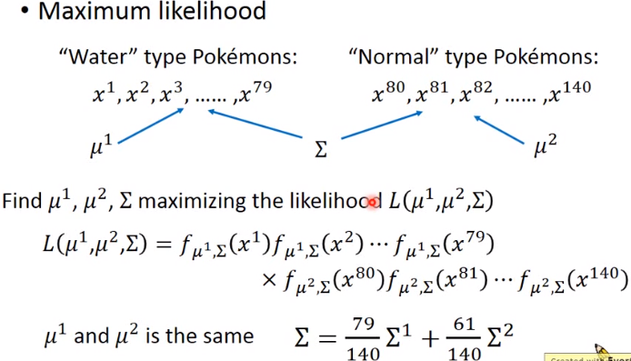

共用sigma后，sigma用加权平均的方式来求，mu还是跟以前一样分别求平均，极大似然估计变成了估计mu1，mu2，sigma

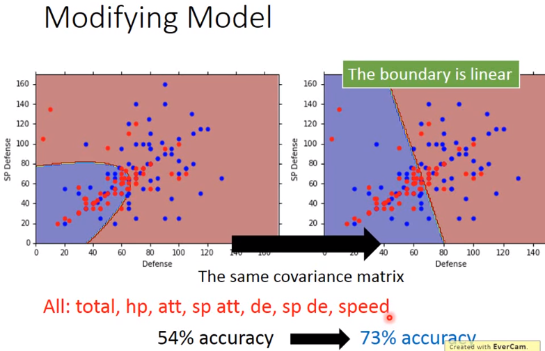

结果有了73percent的准确率（而且分界线变成了直线）

### All in All

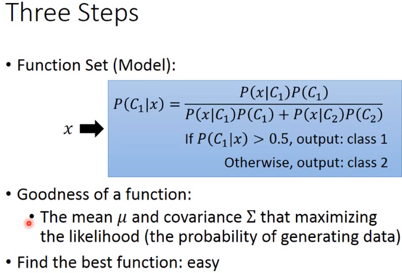

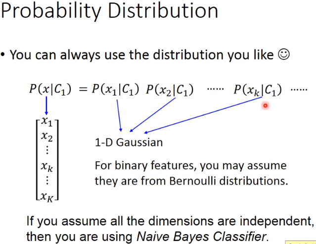

- 为什么用高斯分布？没有为什么，你可以用任何你认为正确的分布，只不过参数的数量不同
- 一种假设：我们假设x的所有feature是独立分布的，那么原来的x的概率就可以分解成每一个feature的概率的的乘积，这样每一的feature的高斯分布就是一个一维高斯分布，sigma就是一个对角矩阵，模型就更加简单，这样产生的分类器被成为朴素贝叶斯分类器（我们之前把feature组成向量去求mu和sigma的方法是把feature之间想象成有关系去做的）
- 对二分类feature，就是feature的值不是数值，而是是或否，比如宝可梦是否神兽之类的，就不太可能服从高斯分布，这时可以用伯努利分布

### 后验概率Posterior Probability

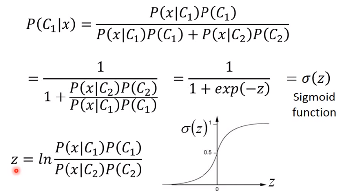

把我们的模型上下同除P(C1)，令z=C1的两概率/C2的两概率的natural log，我们发现模型中分母中那项等于exp(-z)，我们的模型是sigmoid function

下面是一系列数学推导

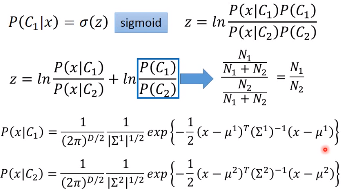

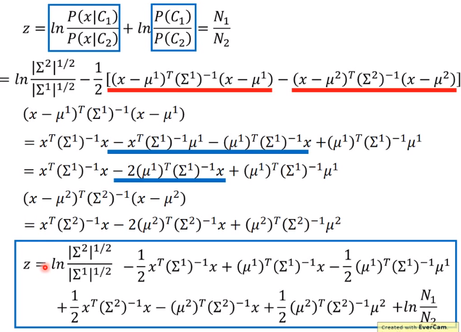

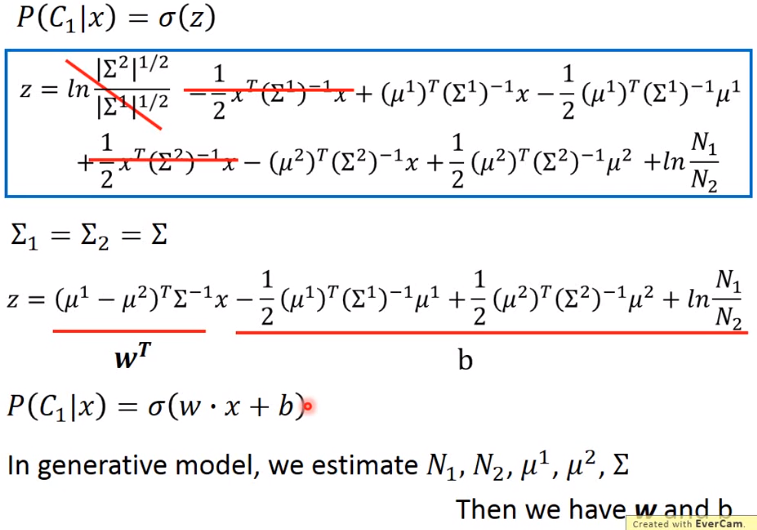

最终可以看出sigma1=sigma2时，P(C1|x)是一个线性模型，我们甚至可以不用去求N，mu，sigma那么多东西，而是直接去求w和b。

## Logistic Regression

### Step 1: Function Set

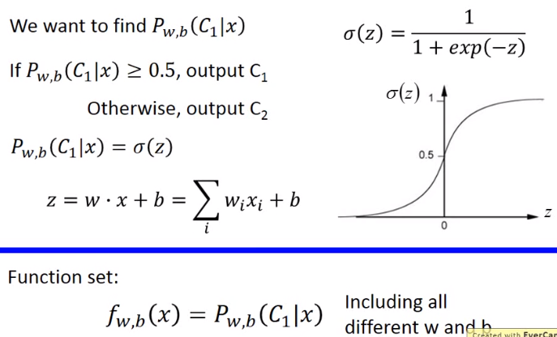

我们要求的是x是C1的概率，我们假设x服从高斯分布的话，这个概率就等于sigmoid(z)，其中z包含两个参数w=(w1,w2,...,wn)和b，下面是图示(里面公式写错了，少了+b）

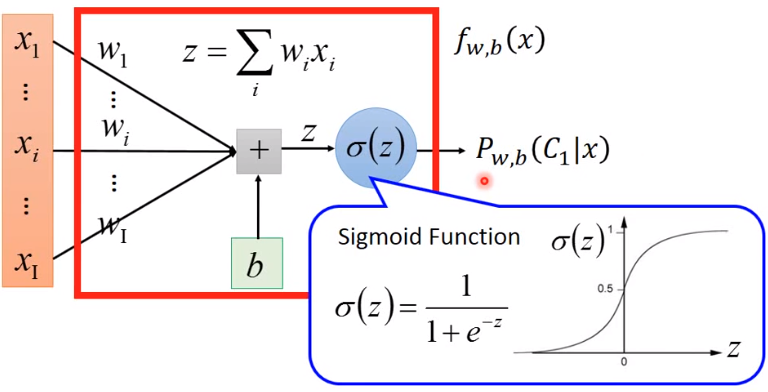

f=sigmoid(wx+b)，这就是逻辑回归Logistic Regression，它的输出是0到1之间的一个概率。

### Step 2：Goodness of a Function

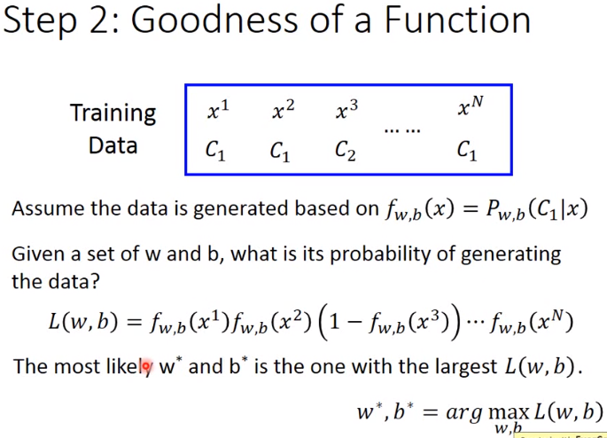

我们由一组training data：x1~N，像极大似然估计一样，我们对function寻优是找一组能够使每个x的几率乘积最大的参数w和b（要使f最符合training data的y-hat，就是让属于C1的x的几率最大，属于C2的x用1减去它属于C1的几率，最大）

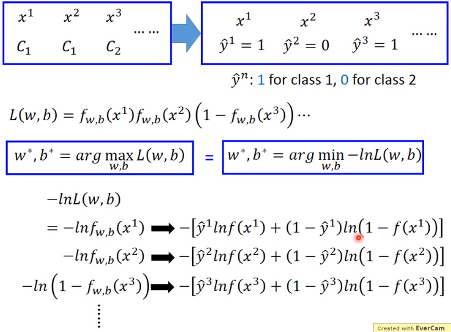

使likelihood最大为了简化计算给它加上一个ln，就可以拆成加法，再前面加一个负号，变成了取最小，这个求和的每一项就是一个**交叉熵Cross entropy**。

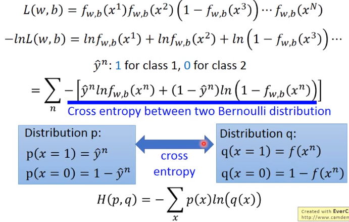

是两个伯努利分布的交叉熵，交叉熵算的是两个分布的接近程度，越接近就越趋向于0。这里In this case，p是现实中的x的分布，属于c1的几率是yhat，不属于是1-yhat，而我们用f预测的分布是，x属于c1是f，不属于是1-f，现在用交叉熵去判断现实与预测是否接近。

### Step 3: Find the best funciton

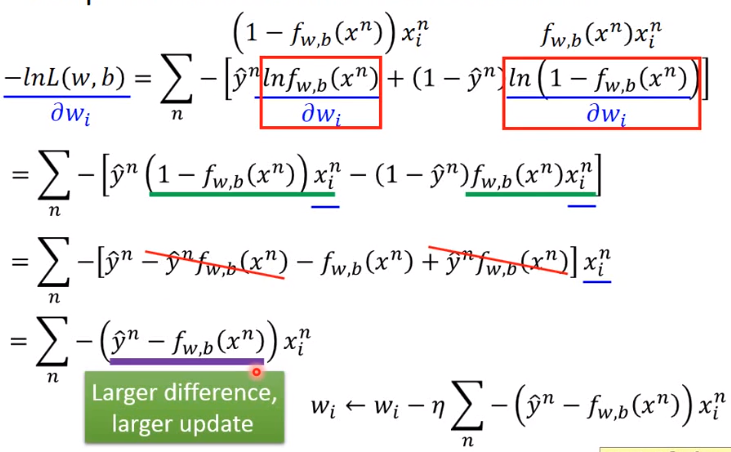

有了Loss函数——即真实分布和预测分布的交叉熵，下一步就是最优化，用Gradient Descent就可以了，对每个wi求偏导，就能求出梯度，上图是推导过程，最后的结果十分neat。（这里上标n是第n个data的意思）

### What if use square error as your Loss function？

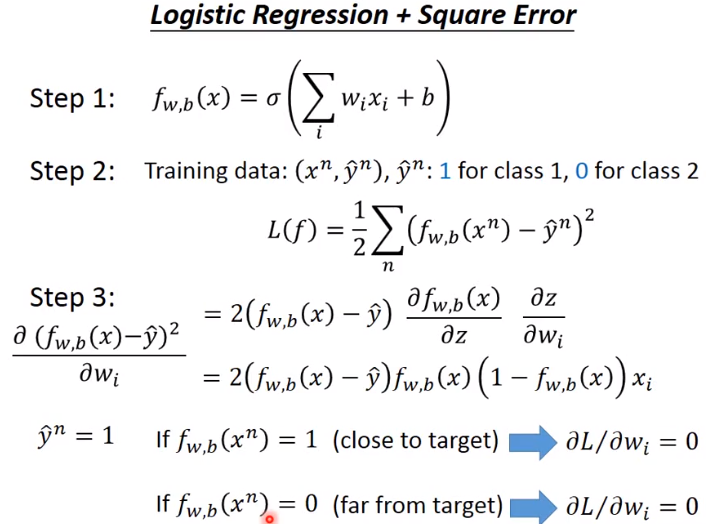

假如用Linear Regression的square error来做Loss function，进行gradient descent就会出现问题，

假如yhat=1，即第n个data是C1类，如果计算的f=1，也就是说拟合的完美，梯度等于0，这没错，但是当f=0时，拟合的完全不对，按式子算出来的梯度也是0，可以验证yhat=0的时候，也是这样。

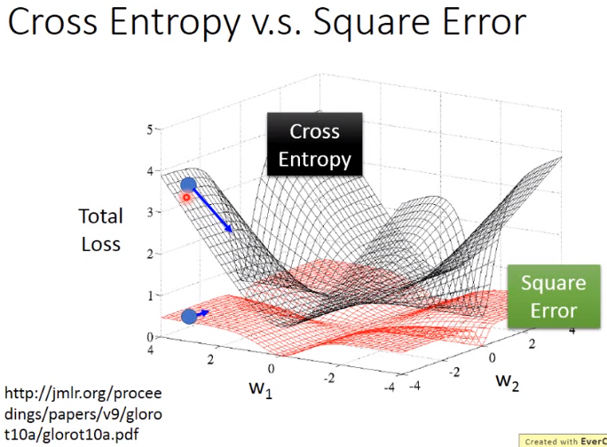

squre error即使在里最优解非常远的地方梯度值也很小，远远不如cross entropy合适。

链接：https://pan.baidu.com/s/1Rx87uRwFe0y6qSI9v61Ghw 
提取码：xwgu
置顶评论上找到的

